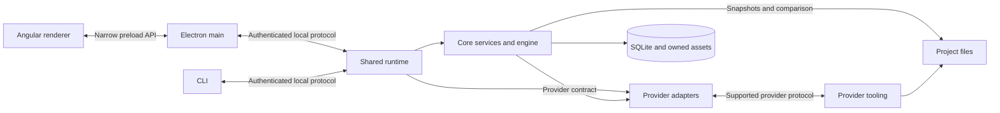

# TeamRun architecture

**Scope:** Component boundaries, durable state, conversation execution, provider integration and application delivery. [README](../README.md) introduces the product to users; [coding standards](CODING-STANDARDS.md) own implementation conventions and secure coding; [UI standards](UI-STANDARDS.md) own appearance and interaction; the [testing contract](TESTING.md) owns execution, coverage and verification evidence.

This document defines TeamRun's architecture. Work, open findings and acceptance evidence belong in GitHub Issues and linked PRs.

## 1. Product boundary

TeamRun is a local desktop workspace for conversations with coding agents about project folders. Its initial migration scope includes conversation history, provider accounts, named teammates, streamed replies, approvals, attachments, project-file evidence and explicit rewind. The desktop and CLI share the same local runtime and durable record.

The local record does not require a TeamRun cloud account or synchronization service. Reading local history can work offline; a provider may still require authentication and network access to answer. Provider-native sessions assist continuity but are not the authority for TeamRun's conversation history.

Delegation, a TeamRun tool server, a native agent loop, remote runtimes and synchronization are separate capabilities, described only by their boundaries in section 11. They are not implied by support for several named teammates.

## 2. Components and dependency direction

The package layout has the following owners and dependency boundaries.

| Component | Responsibility | Dependency boundary |
|---|---|---|
| `src/foundation` | General-purpose primitives, JSON, services, data access and testing | Self-contained packages; no TeamRun domain, provider, Electron or Angular dependency |
| `src/protocol` | Shared validated models, requests, responses and events | Browser-safe foundation packages; no database, process or UI-framework implementation |
| `src/core` | Domain services, persistence, conversation engine, approvals, attachments and workspace evidence | Protocol and foundation; defines the provider-facing contract without importing concrete adapters |
| `src/providers` | Launch and drive provider tooling; translate its protocols into TeamRun results and events | Implements core's provider contract; contains provider-specific SDK/protocol and process details |
| `src/runtime` | Compose services/adapters, own a data directory, authenticate local clients and supervise execution | Core, providers, protocol and foundation; also supplies client connection/launch facilities |
| `src/cli` | Terminal commands and event-following client | Protocol and runtime's client facilities; no separate conversation engine or direct database writes |
| `src/desktop` | Electron main process, preload, OS integration and update coordination | Protocol and runtime's client facilities; Electron remains confined to this boundary |
| `src/renderer` | Angular presentation, view state and local drafts | Protocol and browser-safe foundation; privileged operations go through the preload bridge |

Runtime calls and data flow are shown below; these arrows are not package-import permissions.

Runtime composes the concrete adapters; core knows only its provider contract. The renderer never imports runtime/server code, opens its endpoint or holds its authentication token. Clients share connection facilities without starting another engine inside their own process. Core remains free of Electron and Angular, and foundation has no dependency back into application packages.

## 3. Vocabulary and identity

| Concept | Meaning |
|---|---|
| Project | A local folder where agents work; it is unrelated to GitHub Projects |
| Conversation | A durable thread associated with a project |
| Message | A user, provider or system entry, with author identity, status, content and details |
| Reply | A provider message responding to a user send |
| Send | A user message and its captured list of zero or more replies |
| Provider | A registered integration with supported provider tooling |
| Provider account | A saved provider/profile binding and observed sign-in information; not a copied credential store |
| Teammate | A durable named identity bound to a provider account, with model/effort defaults and optional role instructions |
| Membership | A teammate's participation and native-session state within one conversation |
| Approval | A pending permission decision tied to a specific reply and provider request |

Use stable identifiers for relationships. Display names and paths are not durable identity substitutes. Messages retain the teammate id and displayed name at the time, and user messages retain resolved mention ids/names. Rename, account changes or teammate deletion do not rewrite authorship history. Deleting a teammate removes memberships while keeping historical message identity.

Teammate names are normalized to NFC, contain 1–32 Unicode letters, decimal digits, dashes or underscores, and have a case-insensitive unique lookup key. Preserve display spelling. Visually confusable characters remain distinct identities; do not silently merge them.

## 4. Runtime ownership and local protocol

One runtime owns each canonical data directory. The default location is `~/.noldova/teamrun`; an explicit data directory allows an isolated workspace. The runtime acquires exclusive ownership before opening the application database, reconciling interrupted work, cleaning up provider processes or publishing an endpoint.

Ownership uses a process-held exclusive transaction in a separate SQLite ownership database. Discovery metadata is published atomically and identifies the endpoint, owner process and product/protocol versions. Do not delete the ownership database to break a live lock. Process cleanup must establish recorded ownership, not rely on a reused process id alone.

Windows uses loopback TCP; macOS and Linux use a local Unix socket. Local clients authenticate with a per-runtime capability token held in protected discovery metadata, with appropriate filesystem permissions on each OS. Loopback binding alone is not authentication. The renderer receives neither the token nor the socket. The local endpoint is not exposed as a remote service.

Connections begin with an authenticated version handshake. Subsequent framed requests are correlated with responses; events notify connected clients. The runtime client/server boundary owns framing, request size limits, deadlines, cancellation and disconnect handling. Shared protocol models define domain validation and failures under the coding standards' [wire contract](CODING-STANDARDS.md#the-wire-contract).

The first client may start the runtime; later clients attach. Work may outlive the last client, and the runtime stops after its idle policy permits. Explicit shutdown cancels owned unfinished work, resolves approval waiters, flushes durable state and closes resources. Acknowledging shutdown and verifying process exit are separate requirements. Reconnection must recover from the durable record, not assume every event was received.

The local capability protects the endpoint from unauthorized clients; it is not an OS sandbox against another program running with the same user's privileges. The desktop separately validates IPC senders and limits the operations its preload exposes.

## 5. State and persistence

SQLite is the authority for projects, conversations, messages, approvals, provider-account metadata, teammates and memberships. Core owns the schema, row mapping and domain mutations through the data layer. Use stable ids, indexed query fields and explicit ordering; clients do not write the database directly.

| State | Owner and lifetime |
|---|---|
| Conversation/domain records | Core's SQLite store, within the runtime's exclusive ownership |
| Committed attachments and generated assets | Owned files in the data directory, referenced by durable records |
| Native session identifiers | Conversation/participant execution metadata; scoped to provider and account |
| Provider-managed credentials | Provider tooling, accessed only through its supported interfaces |
| Layout and user preferences | Local client state in the data directory's desktop profile |
| Unsent desktop drafts | Durable per-conversation client storage, including text and file bytes |
| Rendered bodies, model catalogs and preview data | Bounded transient caches; never the durable source of truth |

Related domain writes and their durable change records commit atomically. Live message updates persist enough state for crash recovery without appending an ever-growing full transcript to the permanent change feed for every streamed fragment. A change feed is not a guarantee of complete event delivery or a finished synchronization protocol.

Migrations are ordered, explicit and transactional. Validate that the existing migration history is a recognized prefix before modifying it. Back up an existing database before upgrading its schema using a SQLite-aware operation that includes committed WAL data; verify the completed backup before publishing it as a recovery point. Unknown/newer schemas are refused rather than reset. Destructive rollback, backup retention and committed-asset cleanup require explicit policies; no automatic deletion is assumed.

Unsent desktop drafts use IndexedDB within the data directory's desktop profile, with explicit durable-write acknowledgements. Save immutable file data separately from frequently changing text. Clear a sent draft only if it still matches the submitted snapshot. Failed storage or send operations retain recoverable content and expose an error; an unacknowledged write is not claimed durable.

## 6. Conversation execution and sessions

One conversation has at most one active send, including queued replies and finalization. Different conversations may execute concurrently, including within the same checkout, subject to project-operation coordination.

1. Resolve explicit user mentions outside escaped text, inline/fenced code and email/URL prefixes. Deduplicate in first-occurrence order. Core validates the supplied identities and ordering; stale client resolution is refused.
2. Explicit mentions choose the responders; otherwise use the selected conversation responder. Capture identity, account, model, effort and role settings before execution. Membership or setting changes do not alter a send already captured.
3. Persist the user message, resolved mentions and all pending replies in one transaction. A send result contains the sent message and a reply list, not an assumed single reply.
4. Run captured responders sequentially. An ordinary reply failure does not automatically suppress later responders. Stop and shutdown cancel all unfinished replies in that send, including ones whose provider has not started.
5. Finalize each reply once. Late provider callbacks cannot mutate a terminal reply, reopen an approval or start another responder. Busy state remains until the send's complete lifecycle has ended.

Named teammates bind to saved accounts; the unnamed responder may use the provider's explicit default sign-in. Known unavailable teammates do not answer. If all explicitly mentioned teammates are unavailable, the user message and its mentions still persist with zero replies. Unknown authentication state is not silently reported as signed in or signed out. Provider output does not invite or schedule another teammate in this migration scope.

Membership can be added explicitly or through a resolved user mention of an existing teammate; this does not create a new global teammate definition. Named-teammate configuration changes apply to future sends, while the unnamed responder retains the conversation's own settings. Mutations that remove or rebind an execution owner must refuse while affected work is active.

Each participant has independent session state per conversation and account. A resumed turn receives labelled messages since that participant's previous reply in the applicable session; a fresh, rejoined or rebound participant receives the retained transcript as bounded continuation context. Derive this from persisted messages, without an independent stored last-seen cursor. Include attachment references and an explicit omission notice when history is truncated.

Removing a membership deletes its session state; rejoining creates a fresh membership. Rebinding a teammate's account resets its affected sessions. Rewind resets affected named memberships; an eligible unnamed responder may use a verified provider-native fork, otherwise it continues from the retained transcript. Native fork is an optional adapter capability, not a universal promise.

Roles are supplied through the provider's supported instruction mechanism, or an explicitly identified prompt prefix when necessary. Record how the role was supplied; that is not evidence that a model obeyed it. Stale-session recovery must distinguish failure before a turn starts from an uncertain or already-started turn. Do not retry a potentially mutating provider turn merely because its response was lost.

## 7. Providers, capabilities and approvals

Evaluate Codex's app-server protocol, Claude Code's Agent SDK and Grok's ACP interface during import. Use supported interfaces; do not scrape terminal UI, copy authentication state or call private endpoints. Verify adapter behavior against the selected tooling versions.

Model catalogs are discovered per provider account. Preserve the distinction between an unsupported capability, an empty supported choice list and missing information. Cache discovery with explicit age, size and concurrency limits; coalesce repeated requests, reject late results for another selection, and retain previous choices visibly when a refresh fails. Discovery does not make an unsupported SDK/CLI field valid.

Provider processes receive only their required environment. TeamRun-driven sessions must not inherit unrelated user MCP servers, plugins or account connectors. Profile isolation is an adapter-specific contract that must be verified against the chosen tooling; an empty configuration list is not proof that inherited integrations are disabled. For tooling that requires a dedicated managed profile, create it without reading or copying the user's authentication material. Native sign-in remains a user action.

Adapters normalize text, reasoning, tool activity, file changes, approvals, cancellation and errors into the common protocol. Provenance records requested settings separately from observed provider, model, effort, harness version, account identity and native session/turn ids. Missing observations remain unknown.

An approval is registered before its event is published and is addressed by its own id. Bind the response to the live request and reply; reject stale, duplicate or unrelated decisions. Completing or cancelling a reply resolves its outstanding waiters. Every connected client receives the authoritative outcome.

Provider approvals and any user-enabled auto-approval mode must describe their actual scope and lifetime. They do not imply that the provider asks before every file write, and they are not an OS sandbox. A prompt or role instruction cannot grant permissions. Future TeamRun-owned tools must apply authorization at their privileged execution boundary.

## 8. Attachments and project-file operations

Validate attachment count, original bytes and type at the privileged boundary and in the UI. Limits are ten attachments per send, 10 MiB per native image, 100 MiB per other file and 1,000 MiB combined. Bound encoding overhead separately and respect the selected provider's request-size and format limits.

Prepare files individually into owned temporary storage, then send validated references. Do not construct one request containing all of a message's file bytes. A successful send creates durable asset references without modifying the originals; a partial preparation or failed transaction cleans up only its newly created files. Committed files are not removed through a draft-discard operation. Removing a message or rewinding does not imply deleting every referenced asset.

Preview, copy and download operations pass through the privileged desktop boundary. Validate paths and permitted roots, enforce byte limits, and preserve original bytes for downloads. Clipboard image conversion and display decoding are separate operations. Path canonicalization and permission checks do not establish a filesystem sandbox against hostile concurrent directory replacement.

Project evidence compares the working files before and after a turn, including pre-existing edits and untracked files within the snapshot policy. Use isolated temporary Git indices and preserve the user's actual index, branches and partial staging. Disable external diff/text-conversion hooks during automated comparisons. Report these as shared-workspace changes: a before/after difference alone cannot identify its author.

Project-operation guards use canonical checkout/directory identity and account for nested or overlapping project folders. Rewind with file restoration requires the affected workspace to be idle and prevents new TeamRun turns there until it finishes. Restoring a checkout snapshot can undo completed work from another conversation; idle coordination does not make that rollback selective or control external editors.

Rewind explicitly separates removing conversation messages, resetting/forking provider sessions and optionally restoring files. If a complete snapshot is unavailable or exceeds its configured budget, report that file restoration is unavailable; never describe a partial observation as a complete snapshot. Native-provider history changes do not themselves restore project files.

Forgetting a project or deleting a conversation removes TeamRun records according to their contract; it does not delete the user's project directory. Working-file restoration is a separate explicitly requested operation with its affected scope made clear.

## 9. Renderer synchronization and history

The renderer presents confirmed domain state and owns only client-specific view state and drafts. Snapshot loading and event delivery can overlap: replay or reconcile relevant events against a loaded snapshot and use selection generations so an old response cannot replace a newer conversation. Reconnect reloads potentially missed state. Open replies and approvals remain tracked independently of the currently visible message page.

Separate catalog invalidation from internal execution bookkeeping. Updating a native session id must not force every client to reload all projects/accounts. Domain changes that affect displayed catalogs still invalidate the appropriate data.

History is paged and virtualized. Bound message/summary bodies and expanded details independently. The initial budgets are fifty records per page and up to 150 retained bodies or summaries per active history window; payload bytes, decoded images and asynchronous work need separate limits.

A lightweight visited-row index may retain identity, sequence, measured height and explicit control choices, but no message content. Document its per-entry cost and growth with visited history. Conversation indexes last for their open tab and are released when it closes or is replaced; Activity/Changes indexes last for the selected panel/conversation. Evicting content must not discard layout records or change the reader's scroll range. Overscan and follow-scroll thresholds are implementation settings verified against the UI standards.

Releasing content must not lose the reader's position. Geometry corrections happen before a visible frame where possible; image dimensions are reserved while decoding or reloading. Late image/catalog/history requests must not overwrite a newer selection. Persisted tabs and preferences restore the user's saved workspace without opening an unrelated conversation as a side effect of selection initialization.

## 10. Build, installation and updates

The repository is self-contained. Reviewed foundation source is built here; no sibling checkout, copied installation directory or private reference repository is a build dependency. Exact external dependency versions and lockfiles describe the install inputs. The root manifest owns product and protocol versions, and the build stamps sibling package versions consistently. Published application updates must use a version newer than the installed version.

Compile, package and install local packages through one reproducible path. Tests and the renderer consume the intended fresh installed artifacts; detect stale inputs before trusting results. Public declarations and documentation follow the coding standards' source-owned generation and migration rules.

The target matrix is Windows, Linux and macOS, each on x64 and ARM64. Intended formats are Windows NSIS plus ZIP, macOS DMG plus ZIP, and Linux AppImage. Declare support only after the target's build and native acceptance are verified. Electron application resources use ASAR, with narrowly identified unpacked files where external execution or native loading requires them.

Publish an immutable reviewed revision and matching version, with platform/CPU-specific installers, integrity data and update metadata. Build jobs do not receive publication authority. The publisher consumes the exact artifact identified by the successful build, including when only publication is retried; it must not guess the artifact from the retry's current attempt number. Upload retries are bounded and verify any existing outcome. Incomplete uploads remain unpublished, and published tags/assets are not silently replaced.

The installed updater checks an approved feed for its platform, CPU and release channel. The GitHub release route is anonymous HTTPS; a private repository is not made reachable by injecting repository or provider credentials. Validate metadata and downloaded bytes before offering installation. Production signing/notarization and trust requirements are distinct from an explicitly authorized unsigned test release. Source builds and incompatible targets do not accidentally use a production update feed.

Download and restart/install are explicit user actions; ordinary application close does not install an update. Before replacing application files, coordinate every runtime and desktop using that installation, across data directories: refuse active work, block new launches/requests, freeze editing, acknowledge durable drafts/preferences, stop providers, flush and close databases, verify process exit, and create verified recovery backups. Failure before installer handoff resumes surviving clients safely; uncertainty must not be treated as successful shutdown.

Preserve application identity, existing install location/scope and data-directory compatibility unless an explicit migration changes them. A normal fresh Windows install defaults to the current user; an update uses the existing resolved scope and a quiet installer path. Existing all-users installations may require OS elevation. Ambiguous scope must not silently choose a different installation. An installer failure is not permission to downgrade a database or clear an uncertain launch barrier.

## 11. Deferred capability boundaries

The initial migration does not implement the following capabilities:

- **TeamRun tool server and delegation:** agents operating on TeamRun conversations or scheduling other agents require explicit caller identity, authorization, cancellation and bounded execution. Text mentions in provider output do not enable this behavior today.
- **Key-backed accounts and a native harness:** application-owned keys require reviewed credential storage and per-process access. A TeamRun agent loop for raw model endpoints is a separate execution owner, not another name in the existing CLI adapter list.
- **Remote runtimes and synchronization:** remote execution must identify where the harness and files live and define authenticated transport. Synchronization needs portable project identity, account mapping and conflict rules. Credentials and provider-native session files are not replicated as conversation history; reconnecting remotely and replicating state are different operations.

These directions need their own reviewed contracts before implementation. This document establishes their boundaries without choosing cloud services, billing models or speculative schemas.

## 12. Review and verification boundaries

Review imported components through their declared dependency and data boundaries, preserving licenses and provenance.

[TESTING.md](TESTING.md#6-verification-scope) owns verification scope and evidence: distinguish domain behavior, serialization compatibility, migration/recovery, process ownership/shutdown, renderer interaction, provider isolation, native installation and installed-version upgrades. Keep failures and missing checks in issues/PRs. The coding standards own test authoring and API checks.
