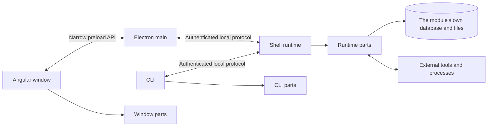

# TeamRun architecture

**Scope:** The shell, modules, runtime, protocol, storage and delivery.
Each module arrives with its document, `src/modules/<id>/README.md`, owning its behavior, data and interface.
[AGENTS.md](../AGENTS.md#documents) maps the other rule owners and defines documentation practice.

## 1. Product boundary

TeamRun's shell owns the window, layout, local runtime, storage and module mechanisms.
Features—conversations, providers, terminals, editors and diffs—belong to modules.

Noldova writes every module and builds, delivers and updates it with the application.
The shell remains usable with any set, including none, showing an empty workspace.
Conversations is included in every release.

The desktop and CLI share the same local runtime and data directory.
Local work requires no TeamRun cloud account or synchronization service.

Section 11 defines the deferred capabilities.

## 2. Components and dependency direction

The package layout has the following owners and dependency boundaries.

| Component | Responsibility | Dependency boundary |
|---|---|---|
| `src/foundation` | General-purpose primitives, JSON, services, data access and testing | Self-contained packages; no shell, module, Electron or Angular dependency |
| `src/shell/protocol` | The local protocol's envelope: handshake, requests, responses, events and failures | Browser-safe foundation packages; no database, process or UI-framework implementation |
| `src/shell/runtime` | Own a data directory, authenticate local clients, host the runtime parts of modules, route their requests and events, provide storage and run migrations | Shell protocol and foundation; also supplies client connection/launch facilities |
| `src/shell/cli` | Command-line client; hosts the CLI parts of modules | Shell protocol and the runtime's client facilities; no direct database writes |
| `src/shell/desktop` | Electron main process, preload, OS integration, the macOS menu bar, notifications and update coordination | Shell protocol and the runtime's client facilities; Electron remains confined to this boundary |
| `src/shell/ui` | The shared kit: tokens, styles, controls, the default theme and the Gallery, which shows each control in every theme and mode | Angular and browser-safe foundation; no shell mechanism and no module |
| `src/shell/window` | The Angular window: docking, tabs, the top bar, the status bar, Settings and the mechanisms of section 5; shows the kit's Gallery as a Settings page in development builds only; hosts the window parts of modules and publishes the contract they implement | Shell protocol, the kit and browser-safe foundation; privileged operations go through the preload bridge |
| `src/modules/<id>` | One module, in a package for each part it has: `protocol`, `runtime`, `window` and `cli` | Foundation, the shell's published APIs and the published APIs of the modules it declares |

Runtime calls and data flow are shown below; these arrows are not package-import permissions.

```mermaid
flowchart LR
  Window[Angular window] <-->|Narrow preload API| Desktop[Electron main]
  Desktop <-->|Authenticated local protocol| Runtime[Shell runtime]
  CLI[CLI] <-->|Authenticated local protocol| Runtime
  Window --> WindowParts[Window parts]
  CLI --> CliParts[CLI parts]
  Runtime --> RuntimeParts[Runtime parts]
  RuntimeParts --> Store[(The module's own database and files)]
  RuntimeParts <--> Tools[External tools and processes]
```

Four rules keep the shell empty:

- **The shell names no module.**
  No production source under `src/shell` or `src/foundation` imports a module or contains an identifier, text or special case that belongs to one.
  Tests and their fixtures are not production source.
- **A module uses only published APIs.**
  It imports its own packages, foundation, the shell's published APIs and the published APIs of the modules it declares as dependencies.
- **The build's module list names the modules an application build includes.**
  It is `teamrun.modules` in the root `package.json`, outside `src/shell`.
  Adding a module changes that list and no shell source.
  The build generates the file that brings the listed modules' window parts into the window, and a test build adds the fixture modules.
- **Automated checks enforce the first two rules and the unique names of section 3 on every change.**

Everything that belongs to a module lives in its folder, `src/modules/<id>`: its parts and their tests, end-to-end tests, styles, assets, migrations and its document.
Adding a module adds its folder and a line in the build's module list; removing it removes both.
Its data has its own folder in the data directory (section 3).

The Angular parts, `src/shell/ui`, `src/shell/window` and modules' window parts, are not packages.
The Angular project in `src/`, with its own manifest and lockfile, compiles them from source into one application.
The kit and the window publish their APIs through their `src/api/index.ts`, which other Angular parts import as `@noldova/teamrun-shell-ui` and `@noldova/teamrun-shell-window`.
The kit's Gallery is not part of its API; only the window's generated Gallery file imports it, through the kit's development entry `@noldova/teamrun-shell-ui/gallery`.
`WindowPartSource` and `MenuDeclarations` are not part of the window's API either.
Only the build's generated window parts import them, through the window's build entry `@noldova/teamrun-shell-window/build`.

Fixture modules exist only for tests.
They live with the tests that use them, in the `fixtures` beside those workflows under the [coding standards](CODING-STANDARDS.md#13-tests), and enter only a test build's module list.

The window and its parts never import runtime code.
Clients share connection facilities without embedding another runtime.
Sections 6 and 8 define their access to privileged operations.

## 3. Vocabulary and identity

| Concept | Meaning |
|---|---|
| Shell | The part of TeamRun that knows no feature: foundation and the packages under `src/shell` |
| Module | A unit of TeamRun's functionality, with its own identity and declared dependencies, built and delivered with the application |
| Host | A process that runs parts: the runtime, the window or the CLI |
| Part | The code of a module that runs in one host: a runtime part, a window part or a CLI part |
| Contribution | An entry a module adds to a shell mechanism, such as a view, a command or a protocol method |
| View | Contributed content for a panel, in a dock or in the middle, or for a dialog |
| Document | Contributed content for a tab in the middle of the window, or for a dialog |
| Setting scope | A level at which a setting can have its own value, such as the application or one object a module owns |
| Theme | An appearance the person chooses: colors for the light and dark modes and a look, defined by the [UI standards](UI-STANDARDS.md#2-themes-and-color) |
| Published API | What a module offers to the modules that depend on it |
| External tool | A program or service outside TeamRun that a module drives, such as a provider's tooling or a command-line shell |

A module's id is its stable identity: lowercase kebab-case, unique, and never reused for another module.
`shell` is reserved for the shell and is no module's id.
Display names are not identity.

Everything a module adds carries its id:

- Names the shell registers have the form `<id>.<name>`: protocol methods and events, commands, menus, settings, setting scopes, views, documents, status bar items, notifications and themes.
  An id contains no dot, so two owners cannot form the same name.
- Selectors and style tokens contain no dot and use the id as a prefix under the [coding](CODING-STANDARDS.md#package-organization) and [UI](UI-STANDARDS.md#9-the-shared-kit-and-modules) rules.
  Prefixes alone do not ensure uniqueness: an automated check rejects duplicate complete names across the shell and all modules.
- A module's folder in the data directory is `modules/<id>` and holds its database and files, so no id collides with the shell's own folders, such as `work` and `logs`.

## 4. Modules

### Parts

A module has only the parts it needs, in any combination: runtime for data, processes and privileged work; window for views and documents; CLI for commands.
Parts exchanging messages keep their models in the module's `protocol` package.

### Declaration

Each module declares itself in `module.json` at its folder's root, with exactly these fields:

| Field | Holds |
|---|---|
| `id` | The module's id, which is its folder's name |
| `version` | The module's own version, `<major>.<minor>.<patch>`: three whole numbers of up to nine digits without leading zeros, such as `0.0.1` |
| `displayName` | The name people see |
| `description` | A sentence that tells people what the module does |
| `parts` | Its parts, each once: `runtime`, `window` or `cli`, each with a folder of that name |
| `dependencies` | The ids of the modules it depends on |
| `contributes` | The names it registers, listed by kind: `methods`, `events`, `commands`, `notifications`, `views`, `documents`, `statusBarItems`, `topBarActions`, `menus`, `themes`, `settings`, `settingScopes` and `cliCommands`, each of the form `<id>.<name>` with a camelCase name |

A module that contributes settings defines them in `settings.json`, one that contributes menus in `menus.json`, and one that contributes command-line commands in `cli.json`, each beside `module.json`, as section 5 describes.
A module without parts may leave `module.json` out until it gains one, but a module the build lists must have it.
An id is lowercase kebab-case, never `shell` and never one of the words the [command line's document](../src/shell/cli/README.md#7-module-commands) reserves for its own commands.
Dependencies form no cycle, and a build refuses a module whose dependency it does not include.
The build validates the declarations, orders them after their dependencies and writes the runtime's and the command line's view of them: each module's id, version, display name, description, dependencies, runtime package, CLI package, contributions, settings and command-line commands, without its parts.
The runtime and the command line read that from `_build/modules/declarations.json` in the repository they are installed in, as the desktop finds the window's build there; a package keeps that layout, as [Packaging](#packaging) describes.
The window's parts and menus reach the window through source the build generates.
A host reads the declarations before it runs any module code, so it applies a theme without activating the module's parts.

### Lifecycle

The runtime decides which modules are active, and the window and the CLI follow it.

1. The runtime reads the build's declarations and orders modules after their dependencies.
2. Each runtime part activates once, registering contributions and published services.
   It receives only shell services and its declared dependencies' published services.
   Before a part with migrations activates, the runtime opens its module's database and applies the pending migrations; a migration that fails, or a schema the migrations don't recognize, leaves the module failed without activating the part.
3. A module is active when its runtime part, if any, and all dependencies have activated.
   Otherwise the runtime records its failure; the shell and unaffected modules continue.
4. After handshake and reconnection, window/CLI hosts receive active modules and failures before sending module requests: `shell.modules` reports every module of the build in module order, with its version, display name, description, dependencies and declared contributions by kind, and its state: active, failed with its cause, or blocked with its cause and the dependency that blocks it.
   They activate only active modules' parts, in dependency order.
   The command line activates only the part of the module whose command it runs and the parts of that module's dependencies, and none for its own commands.
   The window restores its saved layout once, after its parts first activate.
   With no saved layout to restore, documents a part opens while activating open as any document does.
   With a saved layout, the layout alone decides which tabs open: a document a part opens while it first activates shows only when the layout holds it, in its saved place, without changing which tab or document group is active.
   Whenever the runtime is ready again, documents a part opens while it activates never change which tab or document group is active: one already open keeps its place, and a new one joins the end of the active document group, becoming its active tab only when the group is empty.
   Documents opened after activation open as usual.
   The person can open a document, such as Settings by its key, before the window first loads its layout.
   Once the layout loads, such a document opens again, after the documents the parts open while they activate.
   These documents open in the order the person opened them, so the last one is active.
   One the loaded layout already holds is activated where it is.
   One the person closed before the layout loaded does not open again.
   No other change the person made before the layout loaded is kept, such as moving a dock, a tab or a split.
5. When the runtime is ready again, the window keeps its window parts.
   In module order, it asks the part of each module that is still active, and whose dependencies' parts it kept, whether it continues, with `reconnectAsync`.
   A part that continues keeps its context, its contributions and its views and documents, with their focus, scroll positions and unsaved input.
   Before it resolves true, it reads again through its context everything it took from the runtime, because the new runtime may hold other state and events sent while the runtime was away are lost.
   This includes its notifications: it updates each through its handle and posts again one the update finds gone, when it still matters ([Notifications](#notifications)).
   Resolving false is always safe: the window deactivates the part and activates it again, and its views and documents load again.
   A part that fails to continue is rebuilt the same way, and the window logs the failure under its module's id.
   The window also rebuilds every part whose dependency's part it rebuilt, and deactivates the part of a module that is no longer active.
   Only the tabs of modules whose parts changed, or whose state or cause of not starting changed, load again.
   When the runtime stops again while the window is asking, or while it reads anything else once the runtime is ready (settings, modules, commands, its layout, notifications and recent commands), the window changes nothing, reports nothing and reads again once the runtime is ready.
   It knows from the request's `Disconnected` failure, which can arrive before it hears that the runtime is starting again.
   The window's error handler drops that failure, so a request a part makes on its own, such as its views loading again, reports nothing either.
   A part whose reconnection or activation fails this way is asked again, not counted as failed.
   A command, setting change or notification change the person made that fails this way is reported as not confirmed, a recent command goes unrecorded, and a held write, such as the layout, is written once the runtime is ready.
6. Window/CLI activation failure affects that host alone: withdraw the failed part's contributions and do not activate dependent parts there.
   Runtime parts continue serving other clients.
7. The window shows a status-bar item while a module is failed or blocked.
   It opens the Modules document with the first such module selected; the detail of a module that is not active offers its details to copy, redacted, and the data directory's log folder.
   TeamRun has no log viewer of its own.
   A failed module's views keep their places and say why it didn't start.
   Nothing retries, because modules activate when the runtime starts.
   Module failures keep this item; they are not notifications.
   The window names every module, in the module failures, the Modules document, notifications, toasts, command search and Keyboard shortcuts, by the display name `shell.modules` reports, whether or not it has a window part, from the moment `shell.modules` answers, so a notification or command that arrives while window parts activate is named too.
   The Modules document shows every module `shell.modules` reports, with what it declares and its state in this window, and follows them when the runtime starts again.
   The CLI reports failures needed by the requested command.
8. Hosts deactivate parts in reverse order, releasing contributions, subscriptions, timers, files and child processes.

Activation stays light.
A part loads heavy code when its first view opens or its first request arrives.

A runtime part's constructor only sets fields, because the runtime constructs the part before migrating its database.
Its migrations are a fixed list it declares, never computed from data.
The part reaches its database only through its context.
Database calls are synchronous and every client shares one runtime, so queries stay short; long work happens outside a database call, and a transaction's work finishes before the transaction returns.

### Cooperation

Modules cooperate through published APIs, including contracts others implement and register.
They never access another's database, files, settings or internals, directly or through shell internals.
Section 2 governs dependencies.

### Trust

Built-in modules share the shell's privileges; declarations provide no sandbox.
Every part follows the [secure-coding rules](CODING-STANDARDS.md#8-secure-coding), including request data/authority validation, and sections 6 and 8's authenticated runtime and window boundaries.

A module starts an external tool through its context, with only the environment that tool requires (section 6).
A tool's output cannot grant permissions.

### Documentation

Each module's document, `src/modules/<id>/README.md`, has these sections, leaving out those that do not apply: purpose; parts and dependencies; published API; contributions; data (its database, files and what it keeps per device); behavior; and missing decisions.

## 5. Contributions

The shell owns registration, collisions, user overrides, persistence and removal at deactivation; modules own their entries.
The shell has no feature-specific entry lists and registers its own entries, including the default theme and appearance/shortcut settings, through the same mechanisms.

| Mechanism | A module contributes | The shell |
|---|---|---|
| Views | Content for a panel, in a dock or in the middle, with its title and icon, and from its window part a badge for it, a count or a dot with a description, and a mark that its tab is working | Docks, splits, hides and restores it; shows the badge on its icon or after its tab's title, with the description in its accessible name, until the part sets none or is withdrawn; shows a tab the part marks as working as [UI standards](UI-STANDARDS.md#4-tabs-and-navigation) describe, until the part clears the mark or is withdrawn |
| Documents | Content for a tab in one of the middle's document groups; from its window part, each open document's title and breadcrumb, a list of text segments such as a project and a folder, which it may change while the document is open, and a mark that its tab is working | Shows the working mark as it does a view's; opens a document in the active document group, or activates it where it is, and arranges, previews and restores tabs; the shared setting `shell.previewTabs`, on by default, turns previews off so that every open makes an ordinary tab. Shows the active document's breadcrumb and title in the window row and names the window after its title. A saved layout keeps where a document is, not its title or breadcrumb, which the window part gives again when it opens the document |
| Commands | Named actions, each with a title, an optional icon and an optional default key, from its window part or its runtime part | Runs them by name, with optional JSON arguments, from shortcuts, the top bar, the status bar, menus and command search |
| Shortcuts | A default key for a command | Dispatches keys to commands, reports collisions and applies the person's bindings |
| Top bar | Actions for the window's top row, from its window part: an icon, a title and a command to run, which it may update or hide, and the side of the row it asks for, the end by default or the start | Shows them as icon buttons, those at the start right after the menus and the others beside the window controls and the active document's breadcrumb, each side in module order and then declared order; an action whose command is not registered is disabled. The shell's own top bar actions are shell components, not registrations |
| Status bar | Items for its left or right side, from its window part: text, an icon or both, a tooltip and optionally a command to run, which it may update or hide | Shows them along the bottom of the window by side, in module order and then declared order, with the shell's own items, which are shell components rather than registrations, at the right end; an item with a command is a button, disabled while the command is not registered. An item runs a command and opens no popover of its own; a module that needs one waits for the shell to offer it |
| Toolbars | Toolbars of its own, as [toolbars](#toolbars): places in `menus.json` that show as a toolbar, with the items of their groups and optionally where they prefer to stand | Shows them in a band under the window row, lets the person show, hide and drag them, and saves the arrangement in the window layout |
| Main menu | Items for the application menus (File, Edit, View, Window, Help) or a menu of its own, as [menus](#menus) | Builds the menus in the order File, Edit, View, each module's own menus, Window and Help, and shows those with rows in the macOS menu bar or, on Windows and Linux, at the start of the window row as a menu bar or a menu button, as the shared setting `shell.menuBar` chooses (Inline, the default, Button or Hidden; Hidden leaves no menus in the row); their items are also reachable through command search, which lists each enabled row that applies and passes arguments and runs it with its arguments; a row that runs its command without arguments is found as that command, so each command is listed once. macOS keeps its application menu, its own Edit items and its Window menu, so Quit, Copy and Paste work; its Close Window is Cmd+Shift+W, leaving Cmd+W to close the tab |
| Context menus | Items for the shell's tab menu and for its own context menus, as [menus](#menus) | Shows a place's groups in order and opens a module's own context menus where its window part asks |
| Notifications | Notifications of the kinds it declares, from its runtime or window part: a title, optional text, a severity, an optional command that opening one runs, up to two actions and optional progress | Holds them for the runtime's life and shows them in the window and, when TeamRun's window isn't focused, through the operating system's notification service when the person's settings allow it |
| Settings | Settings with defaults and the scopes that may override them, their pages, and setting scopes for the objects it owns | Stores the values per scope, resolves the effective value, shows the pages and reports changes |
| Themes | Themes in its declaration: for each, colors for the light and dark modes and a look, as data. The declaration lists only theme names so far; the format of that data is decided when a second theme is built | Offers them in Settings and applies the person's theme and mode before the window paints; uses the default theme when the chosen one is absent |
| Protocol | Methods and events | Authenticates, routes and delivers them |
| Storage | Its database's tables and migrations, and its files | Creates, migrates, backs up and closes its database |
| CLI | Commands under its id, from its CLI part, as [command-line commands](#command-line-commands): each with its arguments, options and help | Reads the command line against the declaration, prints the help, runs the command and prints its result |

When two default shortcuts collide, the one registered first keeps the key, Settings shows the collision, and the person's binding decides.
A saved layout keeps the place of a view or document whose module is absent and shows it again when the module returns.

### Views in a dialog

Besides docks and tabs, a view or document can show in a large modal dialog.
A window part asks with `showInDialogAsync(name, { instance, title })` for its own views and documents, its dependencies' and the shell's, and the promise settles when the dialog closes; the shell runs `shell.showInDialog` with the `tab` argument.
The person has no way of their own to open one.
Asking while any dialog is open is refused.

A view or document already open in a tab moves into the dialog: its tab stays where it is with an empty panel, and its content returns there when the dialog closes, so the saved layout never changes.
One that was not open closes with the dialog.
It moves there as the same live view, as when a tab moves between groups ([Window](#8-window)).
The dialog closes when its view's module goes away or the tab it came from closes.
When a document other than its own opens or is activated while it shows, as when a command run from the view opens one, the dialog closes, the view returns to its place, and the document's tab shows active with focus.
When it closes and the control that opened it is gone, as when the view showed itself, focus goes to the view's tab.
Its module's keys work in it as in its tab, while a shell view or document, such as Settings, adds no keys; Commands and shortcuts says which other keys run.

### Content padding

The shell pads the page of every view and document, so a module's content keeps the same distance from its panel's edges as every other's without setting one itself: at the sides by the theme's content padding, and at the top and bottom by its view padding in a dock and its document padding in the middle or in a dialog.
Where a page shows decides its padding, not whether it is a view or a document.
[UI-STANDARDS.md](UI-STANDARDS.md#8-component-metrics-and-behavior) owns the values.
A page that runs edge to edge, such as a terminal, a code editor or a page that sets its own spacing, turns the padding off at one of three levels:

| Level | Where | Applies to |
|---|---|---|
| Module | The window part's `padding` | Its views and documents that declare none |
| Declaration | The `padding` argument of a view's or document's contribution | That view or document |
| Page | `set` and `reset` on the `ContentPaddingRef` its component injects with `WindowPartTokens.contentPadding` | That page while it is shown, until it resets |

Each level chooses `Default`, the shell's padding for where the page shows, or `None`; none sets its own values.
The page's choice wins over its declaration's, the declaration's over its module's, and the module's over the shell's default.
The shell's own Settings and Modules documents declare `None` and keep their own layout.
[The window's declarations](../src/shell/window/src/api/index.d.ts) show each level.

### Commands and shortcuts

A module declares each command's name in `contributes.commands`; a part registers it with its title, icon, default key and handler, and a name the declaration lacks is refused.
A window part's command runs in the window.
A runtime part's command runs in the runtime: the window lists them with `shell.commands` after `shell.modules` and runs one with `shell.runCommand`, passing its arguments to the handler.
Both kinds are withdrawn when their module deactivates.

A runtime command has one state for all arguments: enabled or not, and, when it was created with a checked state, checked or not.
The runtime counts each registration, withdrawal and state change, and `shell.commands` and the event `shell.commandsChanged` carry the whole list with that count as its sequence.
A window takes its state from its first `shell.commands` answer and follows the event, keeping whichever list has the higher sequence, so an event that arrives before an older answer is not undone; while the runtime is away its commands are disabled, and a new runtime's first answer counts again.
`shell.runCommand` refuses a command that is not enabled, for windows and the command line alike.
Argument-dependent state is for window commands.

A key is written as any of `Mod`, `Ctrl`, `Alt` and `Shift` joined by `+` to one key, such as `Mod+Shift+K`.
`Mod` is Ctrl on Windows and Linux and Cmd on macOS; `Ctrl` is Control everywhere; there is no token for the Windows, Super or Meta key.
Letters match the key's value, falling back to its place when the layout's value is not a Latin letter; digits, punctuation and Space match the key's place, since Shift and layouts change their value.
A default key needs Mod, Ctrl or Alt, or is a function key, so that typing is never taken, and may not be a key that editing or the operating system owns on any platform:

- editing: Mod+A, C, V, X, Z and Y, and Mod+Shift+Z;
- macOS: Mod+Q, W, H, M, Comma, Tab and Space, and Mod+Alt+Escape;
- Windows and Linux: Alt+F4, Alt+Tab and Mod+Escape.

The shell's own commands may also take Mod+W and Mod+Comma, which the shell handles itself, as defaults or as the person's bindings; a module's command may not.

Menus show a key by the platform's convention: macOS symbols in the order ⌃⌥⇧⌘ before the key, and elsewhere names such as `Ctrl+Alt+Shift+K`.

The shell's own actions are commands too, named `shell.*`: closing, keeping and moving tabs, showing the next or previous tab of a group, wrapping at its ends, splitting and docking tabs, showing and hiding docks, spanning the bottom dock across the window or keeping it between the side docks, resetting the layout, showing all of a group's tabs, showing a view or document in a dialog and showing all commands, whose search lists every enabled command and those main-menu rows, and runs the chosen one.
The shell's most-used commands have default keys, which UI-STANDARDS lists.
A shell command may have several, chosen per platform, while a module's command has at most one, the same everywhere; menus and command search show the first.
A tab command acts on the tab its `tab` argument names, or else on the current tab, the active tab of the group that last held focus or had a tab activated; the shell's menus run the same commands.
A command may say whether it is enabled for given arguments.

Command search lists first the commands the device last ran from it, newest first, as many as the shared setting `shell.recentCommandCount` asks, 5 by default and none at 0; commands run by keys, menus or toolbars do not count.
The runtime keeps each device's 20 newest in the shell's database, so the list outlives a restart and every window of the device shares it.
A window reads it with `shell.recentCommands` and records a command it ran with `shell.recordCommand`, which publishes `shell.recentCommandsChanged` with the device's new list; the desktop adds its device to both requests and passes the event only to that device's windows, without the device.
A recorded command that is no longer listed, such as one whose module is absent, is left out and keeps its place for when it returns.

The window keeps one keyboard listener on the document, after every element's own.
A key an input, editor or terminal handled, a key during text composition, a repeated key and the key of a command that is not enabled are left alone; a key bound to an enabled command runs it and goes no further.
While a modal dialog is open, only the Edit commands run from keys and the macOS menu bar, so the window behind does not change; while a view's dialog is the topmost one, its module's commands run too, as they would in its tab.
The shell's other commands stay held, and a dialog above it, such as the quit question, holds all but the Edit commands again.
Keys go to commands in this order: the person's bindings first, then the shell's default keys, then default keys in module order, as `shell.modules` reports it, with a module's runtime commands before its window commands.
The first holder keeps a key and each refused command is recorded as a collision.

The person's bindings are the shared setting `shell.keyBindings`, so they follow the person to every device: an object from a command's name to its key, or to `null` when the person removed the command's key, `{}` by default.
A binding has one key or none and replaces all of its command's default keys.
Its key follows the rules for a default key on every platform, so a binding made on one device is valid on all of them, and the runtime refuses a value that breaks them.
A binding for a command that is not registered, such as one whose module is absent, is kept and applies when the command returns.
Every window follows the setting's changes, so menus, the macOS menu bar, command search and Settings show a new key at once.
A key a binding holds can meet another later, such as a newly installed module's default or a binding made on another device; the first holder in the order above keeps it, and Settings shows the refused command's collision until the person changes either key.

### Menus

A menu is a named place: the shell's `shell.file`, `shell.edit`, `shell.view`, `shell.window` and `shell.help` in the main menu, its tab menu `shell.tab` and its text field menu `shell.field`, and the places a module declares in `contributes.menus`.
A module describes its places and items in `menus.json` beside `module.json`, which the build validates:

- `places`: each declared place once, with its `title` and what it `shows`: `menu` for a context menu or a submenu, the default; `menuBar` for a menu of its own in the main menu; or `toolbar`, which [toolbars](#toolbars) describe.
- `groups`: each with an `<id>.<name>` name, the `place` it adds to, `exclusive` and either its `items` or `dynamic`, true for a group whose items its window part supplies.
  An item runs a `command` with optional `arguments`, a JSON object, and an optional `label`, or opens one of the module's own places as a `submenu` or as a `choice`; no place contains itself through either.

A module adds groups to the shell's places, its own and those of the modules it depends on, and its items run its own commands and its dependencies'.
A place shows the shell's groups first, then each running module's in module order, each group's items in declared order, with separators between groups; a module never adds items to another owner's group, and an empty place or group is left out.
A row shows its item's label, or else its command's title, with the command's icon and key, so menus can be short while command search keeps the full titles.
A command may say whether it applies to given arguments: a row whose command does not apply is left out, and one that applies is enabled when the command is; a row whose command is not registered shows its label or its name, disabled.
A submenu takes its place's title and is left out while the place has no rows.
A command may report whether it is checked for given arguments, which shows as a checkbox row, or as a radio row in an exclusive group.

A window part supplies the items of a dynamic group of its own module with `provideMenuGroup`, which takes the group's name and a function from the context object to the rows, each a command with optional arguments and label from its own module or a dependency, and returns a function that withdraws them; the shell asks again whenever the menu or toolbar is built, and a group without rows is left out.
A part may supply only groups its module declares as dynamic.
A window part opens its own places and its dependencies' as context menus with the `trMenu` directive, giving a place and a context object.
The context is merged into each item's arguments, the item's own fields winning, so one declared item acts on whatever the menu was opened on.

The shell's own groups put Close the tab in File, and command search, Left dock, Right dock and Bottom dock as checkbox rows, the bottom dock across the window or between the side docks, and Reset the layout in View, and Settings… in the macOS application menu after About.
On Windows and Linux, Edit holds Undo, Redo, Cut, Copy, Paste and Select all: each acts on the field that had focus before a menu took it, with the field's selection restored first, and is enabled only when that field allows it, such as Copy only with a selection and Paste only into a field that can be written.
The text field menu, `shell.field`, holds Cut, Copy, Paste and Select all, acting and enabled the same way, on every platform.
On a misspelled word it starts with the spell checker's suggestions, each replacing the word, and Add to dictionary.
Only the desktop knows the word and its suggestions, from the window's `context-menu` event, so the window leaves a field's right click, menu key and Shift+F10 to the desktop, which sends the word and suggestions back.
The window opens the menu when that message matches the click or key it noted, or opens the menu without suggestions after 300 ms, so a missing message cannot lose the menu and a late one cannot open it elsewhere.
Add to dictionary adds the word to the spell checker's user dictionary: on Linux that is TeamRun's own file in the profile, and on Windows and macOS it is the system's, which every program shares.
It opens as the context menu of a text field or rich text anywhere in the window outside overlays, anchored to the field, unless the field's own context menu has taken the right click or key, and returns focus to the field when it closes.
The tab menu is built from the shell's groups in `shell.tab` the same way, for the tab it was opened on: Keep open, Move to, Split and Dock, Move left and Move right, then the close commands.
Rows that can never apply to that tab are left out, such as Keep open on a kept tab and Move to, Split and Dock on a document.
Move to lists the groups that would accept the tab, which the shell supplies as the menu opens.
On macOS the window gives the desktop the main menu's rows whenever they change, and the desktop builds the native menu bar from them: a row shows its key without taking it from the window, so the window's key handling stays the only one, and choosing a row runs it in the window.
The Edit and Window menus keep the system's own items, with their keys, before the shell's and modules' rows.

### Toolbars

A toolbar is a place whose `shows` is `toolbar`.
It takes `shown`, true by default, and at most one of `after` or `before`, each naming another toolbar, and `newRow`, which say where it prefers to stand until the person moves it.
A toolbar holds its groups in order, with a separator between groups, and an item is one of four kinds: a command, a button that is a toggle while the command reports it is checked; a `submenu`, a dropdown of the place's rows; a `choice`, a dropdown that shows the place's checked row as its label and opens the place's rows to pick another; or a dynamic group's rows, which are commands.
A toolbar with no row is left out, and the band is absent while no toolbar has one.
The look is [UI-STANDARDS](UI-STANDARDS.md#8-component-metrics-and-behavior).

The window keeps each window's arrangement in its layout: the toolbars of each row in order and the names the person hid.
A toolbar the layout does not name stands where its declaration says: shown unless `shown` is false, after or before the toolbar it names once that one stands, in a row of its own with `newRow`, and otherwise at the end of the last row.
A toolbar of an absent module stands nowhere but keeps its saved place, and one the person hid stays hidden.
The person shows or hides a toolbar from the Toolbars submenu of View, which lists every toolbar as a checkbox row, or from the context menu of the band, and drags a toolbar by its grip to another place in its row, to another row, or to a new row above or below one, or without a pointer from the toolbar's own menu, which its grip opens and the Menu key or Shift+F10 opens from any item of the toolbar, with rows that move it left, right, to the row above or to the row below, and hide it.
Reset the layout returns every toolbar to its declared place.
The shell commands that show, hide or move a toolbar take it as their `toolbar` argument, so a list of commands does not offer them and command search lists the rows of View's Toolbars submenu instead; `shell.focusToolbars` has no default key and works from command search and shortcuts.

### Settings

A module adds settings only through the fields below, never with a screen of its own.
A module that needs a richer screen opens a document of its own, and an `Action` setting's row can open it.
A module defines each setting it contributes in `settings.json`, an object whose only field, `settings`, lists them.
A setting has exactly these fields, and the build refuses a file whose settings differ from those `module.json` declares; the build and the runtime both refuse an `Action` whose command the module does not declare:

| Field | Holds |
|---|---|
| `name` | The setting's name, `<id>.<name>` |
| `title`, `description` | What Settings shows for it |
| `type` | Its `kind` and that kind's limits: `Boolean`; `Choice` with `options`, each a `value` and a `title`; `Number` with `minimum`, `maximum` and `step`; `Text` with `maxLength`; `Modules`, a list of distinct module ids; or `Action` with `command`, one of the module's own commands, and `label`, the text of a button that runs the command; an action holds no value, so its default is `null` and nothing is stored. `KeyBindings` and `Languages`, a list of distinct spelling language tags such as `en-US`, are the shell's own kinds, which a module cannot declare |
| `default` | A value its type accepts |
| `locality` | `Shared`, one value for every device that shares the data directory, or `Device`, a value per device |
| `scopes` | The setting scopes that may override it, its module's own or a dependency's; a device setting has none |
| `page`, `group` | Where Settings shows it |

The shell keeps the values in its database and reports every change with the event `shell.settingsChanged`, whose payload is the changed key, the value now in effect and whether a value is stored for the key, false after a reset.
Setting a value equal to the setting's default, compared by value, is a reset when the setting would otherwise take its default, so every way of changing a setting removes the stored value and the setting follows its default from then on; a scope whose enclosing scope holds another value keeps the value it is given.
A part reads the settings of its module, its dependencies and the shell, for the application or for one of the scopes a setting lists, and changes only its own module's.
A window reads them all with `shell.settings`, reads one key's entry, its value in effect and whether the key itself holds it, with `shell.readSetting`, and changes them with `shell.setSetting` and `shell.resetSetting`; the desktop adds its device to these requests and passes a device's change only to that device's windows.
A stored value its setting's type no longer accepts, such as a removed choice, is kept but ignored, and reported once in the runtime's log.

The shell shows Settings as a document of its own, `shell.settings`, which `shell.openSettings` opens or reveals.
Its pages come from the settings' `page` and `group` fields: Appearance, Notifications and Keyboard shortcuts first, then the modules' pages in the order they first appear.
Keyboard shortcuts lists every command with its owner and key.
The person records a new key, removes a key, resets a command to its default or resets every shortcut, and each change writes `shell.keyBindings` whole, in one write, built on the window's previous change until the setting reports that change; when two windows change it at the same moment, the later write is kept.
A key the rules refuse is refused with the reason, and a key another command holds is shown with that command: Use it here gives the key to this command; the other command keeps its other default keys if it has any, and is left without a key otherwise.
[UI-STANDARDS](UI-STANDARDS.md#8-component-metrics-and-behavior) describes the row.
The window applies the appearance settings as soon as they load and on every change.
The desktop keeps the device's last appearance preferences outside the data directory and gives them to the window before its first frame, so a restart paints in the chosen theme and mode without a flash.

Appearance's Spelling group holds two settings.
Check spelling, `shell.spellCheck`, is shared and on by default.
Spelling languages, `shell.spellCheckLanguages`, is a device setting of the kind `Languages`, `[]` by default; Settings offers it as a checkbox for each language whose dictionary ships with the desktop, in the order the desktop gives them, and says so when it offers none.
A chosen language that no longer ships is dropped at the next change.
`[]` checks in the operating system's languages that ship; when none of them ships, the first shipped language is used and the row says which.
On macOS the system chooses the languages.

### Setting scopes

The application scope belongs to the shell.
A module that owns a kind of object, such as a project or a conversation, contributes a scope for it and tells the shell which object encloses each one, such as a conversation's project; an object with none falls under the application scope.
A setting declares which scopes may override it.
Its effective value comes from the most specific scope that sets it, then each enclosing scope, then the application scope, then the default.
A change is reported for the key that changed only, so a part that shows a value read for a scope reads it again when an enclosing scope or the application changes.
When an object is deleted, the scope's owner asks the shell to remove the values stored for it.

### Notifications

The shell owns notifications.
A module decides when something deserves one; muting, for example for one conversation, is a setting at that object's scope, applied by the module.
The shell shows a notification without taking focus.
Opening it brings TeamRun's window forward and runs the notification's command.
Settings' Notifications page holds three settings.
Do not disturb, `shell.doNotDisturb`, is a device setting: on that device it stops the window's toasts and the operating system's notifications and shows the silenced bell.
Notifications from modules, `shell.mutedModules`, lists the modules turned off on every device, choosing among the modules that declare notification kinds, whatever their parts, as `shell.modules` reports them: their notifications still enter the list, without a toast, an operating system notification or a place in the unread count.
Either way each notification stays in the list.
Showing TeamRun's icon in the tray, `shell.trayIcon`, is a device setting whose title depends on the platform, described in [Tray](#tray).

A module declares its notification kinds in `contributes.notifications`.
A part posts a notification of one of them through its context and gets a handle that updates or dismisses it.
The shell posts kinds of its own, `shell.saveFailed` and `shell.saveUnfinished` (section 9): they belong to no module, offer no command, and turning modules' notifications off never mutes them.

- Its commands, the one opening it runs and those of its actions, are the module's own or a dependency's.
  A post with an undeclared kind or another module's command is refused.
- Posting the same kind and key again replaces the earlier notification: it keeps its id and returns to the top, unread, because a new post is a new occurrence that deserves attention.
  An update through the handle is the same occurrence changing, such as progress moving on, so it keeps its place, time and whether it was read, and never changes its kind.
- The runtime holds the list, newest first, for its own life.
  It keeps at most 100, dropping the oldest that report no work in progress.
- Windows read the list with `shell.notifications` and follow the event of the same name, which carries the whole list after every change.
  A window part posts with `shell.postNotification` and changes or removes its notifications with `shell.updateNotification` and `shell.dismissNotification`; a post for a module that is not active is refused.
- When a module's runtime part deactivates, all of its notifications are dismissed.
  When a window part is withdrawn, the notifications it posted are dismissed.
- The runtime gives each notification an id that no other notification has, in this run of the runtime or any other, so a handle never reaches another notification.
  An update through a handle tells the part whether the notification is still there: it is gone once the person dismissed it, it was cleared or dropped from a full list, or the runtime started again.
  A window part that continues after the runtime started again updates what it posted and posts again what is gone, when it still matters; after a broken connection to the same runtime, its notifications and handles stay as they were.
  The runtime cannot tell which module sends a window's update or dismissal, because the desktop sends every window part's requests and the person's own over one connection; the window lets a part reach only its own notifications, and an update never changes a notification's kind.
- The list marks every notification read when the person opens it, and Clear all removes every notification that reports no work in progress; those still in progress stay, because their modules update them.
- The runtime gives each post and re-post the next sequence number, which an update keeps, and the list and its event carry the latest.
  A window reads the list once its window parts have activated, and toasts only notifications with a higher sequence than that read, so nothing posted before it toasts after a reload or reconnection.
  Activation does not await a part's posts, and the desktop resolves its device before passing the read on, so the posts and the read have no shared order: the window waits until every post its parts made while activating is answered before it reads.
- While its window is focused and Do not disturb is off, the window shows those toasts for modules not turned off, at most one of a kind every 5 s; the rest wait in the list.
- While no window is focused, the desktop shows each new notification through the operating system instead, with its title, text and the application's icon, never for an update or work in progress, while Do not disturb is on, for a module turned off, or when the device's identity is unknown.
  It counts from the window's own read of the list, holding broadcasts while the window loads until that read answers, so it counts from the same point as the toasts.
  Clicking one brings the window forward, and the window runs the notification's command, because that command may be a window part's.
  The operating system's notification closes when the notification is dismissed, cleared or replaced.
  TeamRun never asks for permission upfront; a refusal leaves the notification in the list, and the first failure is logged.
- The list and its event carry the modules turned off and whether Do not disturb is on, and the runtime publishes the event again when either setting changes.
  The event carries the devices with Do not disturb on; the desktop adds its own device to its window's `shell.notifications` request and forwards the event as the state for that device, so the device's identity never reaches the window.
  The window changes both settings through `shell.setSetting`, like any other setting.

### Command-line commands

A module's CLI part registers the commands that `contributes.cliCommands` declares, each with its handler, and each runs under its module's id: `notes.addNote` is `teamrun notes add-note`, the kebab-case form of its name.
A module defines them in `cli.json`, an object whose only field, `commands`, lists them, and the build refuses a file whose commands differ from those `module.json` declares.
A command has exactly these fields:

| Field | Holds |
|---|---|
| `name` | The command's name, `<id>.<name>` |
| `summary` | One line for the list of commands in the help |
| `description` | Optional text for the command's own help |
| `arguments` | Its positional arguments in order, each with a camelCase `name`, a `description`, `required`, true by default, and `variadic`, false by default, for a last argument that takes the rest of the line |
| `options` | Its options, each with a camelCase `name`, a `description` and a `type`: `Text`, `Number` or `Boolean`. A `Text` or `Number` option also takes `required` and `repeated`, both false by default, and a `default` its type accepts, which a required or repeated option has none of. A `Boolean` option takes no value and is true when given |
| `examples` | Optional examples, each with `arguments`, the text after `teamrun <id> <command>`, and a `description` |

The command line shows an argument as `<kebab-case>` and an option as `--kebab-case`.
The build also refuses a command whose arguments and options repeat a name, a required argument after an optional one, a variadic argument that is not last, and an option whose command-line form is one of the command line's global options.

The command line reads the call against the declaration before it starts or reaches a runtime, so a call that does not match starts none.
It gives the handler the arguments and options as one frozen object keyed by their names, holding the default or nothing for those not given, and a signal that aborts when the command is cancelled or times out.
A command reaches its module's runtime part only through requests on the command line's connection, never through the module's database or files.
The handler returns the command's result, a JSON value and the text for people; the command line owns the output, and a part never writes to it.
Help comes from the declarations alone, without a runtime or module code.
The [command line's document](../src/shell/cli/README.md#7-module-commands) owns the syntax, the help, the output and the exit codes.

## 6. Runtime ownership and local protocol

### Ownership

- One runtime owns each canonical data directory.
  The default location is `~/.noldova/teamrun`; an explicit data directory allows an isolated workspace.
  Development and test runs never default to the person's data directory: each checkout uses its own unless one is given.
- The runtime acquires exclusive ownership before opening a database, activating a module, cleaning up owned processes or publishing an endpoint.
- Ownership uses a process-held exclusive transaction in a separate SQLite ownership database.
  Do not delete the ownership database to break a live lock.
- A stopping runtime releases ownership last, after closing its databases and its log, so a data directory that no one owns holds no file its runtime opened.
- A starting runtime that finds the directory owned leaves it to an owner that has published discovery.
  An owner without discovery is starting or stopping, so the new runtime keeps trying to take over for up to five seconds and leaves as soon as that owner publishes discovery.
- The device folder keeps what belongs to the device rather than to a data directory: its identity, its last appearance preferences and each installation's record and launch barrier.
  It is in the operating system's local application data by default; `--device-dir` names another for the desktop and the command line, as `--data-dir` names a data directory, and test runs give one of their own.
- The launcher gives the runtime it starts its installation's folder.
  Once it owns the directory and before it publishes discovery, the runtime adds the directory to its installation's record and checks the launch barrier, releasing ownership and exiting while the barrier holds, so a runtime whose launcher found no barrier cannot slip into an update that began meanwhile ([Stopping for an update](#stopping-for-an-update)).
- Discovery metadata is published atomically and identifies the endpoint, the owner process and the program it runs from, the product and protocol versions and the runtime's build.
- A new owner removes the discovery metadata an earlier owner left behind before it listens, because on macOS and Linux it reuses that owner's socket path.
  A launcher whose token is refused tries again only when the metadata has changed since it read it, at most three times.
- Process cleanup must establish recorded ownership, not rely on a reused process id alone.

### Endpoint and authentication

- Windows uses loopback TCP; macOS and Linux use a local Unix socket.
  The local endpoint is not exposed as a remote service.
- Local clients authenticate with a per-runtime capability token held in protected discovery metadata, with appropriate filesystem permissions on each OS.
  Loopback binding alone is not authentication.
- The window receives neither the token nor the socket.
- The local capability protects the endpoint from unauthorized clients; it is not an OS sandbox against another program running with the same user's privileges.
  The desktop separately validates IPC senders and limits the operations its preload exposes.

### Messages

- Connections begin with an authenticated version handshake.
  Subsequent framed requests are correlated with responses; events notify connected clients.
- The runtime client/server boundary owns framing, request size limits, deadlines, cancellation and disconnect handling.
  Nothing over the frame limit is sent, and the connection stays open.
  A request or answer over the limit fails its call with `FrameTooLarge`.
  The runtime logs an event over the limit once and sends it to no client, so clients never see different events.
  Receiving a frame over the limit ends the connection.
  The runtime first answers the client with the failure, and the desktop logs why it ended a connection.
- The desktop and the command line answer a request they have no connection for, or whose connection ended before the answer, with `Disconnected`; the runtime never sends it.
  A call that gets no answer in time on a connection that is still open stays `Unavailable`.
- When its connection ends, the desktop connects again, whatever ended it.
  A connection that ends within 30 seconds of being ready ends soon.
  The first end after a connection that stayed ready longer reconnects at once, so a runtime that starts again costs no wait.
  Each further end soon in a row waits 1, 2, 4 and then 8 seconds first, and the sixth stops: the window shows the start failure with the last cause, and the desktop logs it.
  Trying again counts afresh, and closing ends a wait at once.
  Like desktop clients that restart a lost local process at once and give up after a few quick failures, this keeps a fault on every connection from becoming a loop.
- The shell validates protocol envelopes without knowing module models.
  Methods and events follow section 3's naming rules, using `shell.<name>` for shell-owned entries.
- The runtime routes only methods registered by active parts; the owning part validates payloads and reports failures under the [wire contract](CODING-STANDARDS.md#the-wire-contract).

### Builds and lifetime

- The first client may start a runtime; later clients attach only to their own build, carrying the same modules without separate module-protocol negotiation.
- A newer build takes over a directory an older build's runtime owns by itself.
  It asks the older runtime to stop; if work is in progress, the person makes section 9's choice to wait for it or stop it; then the older runtime exits and the newer one starts.
  An older build that finds a newer runtime hands the person over to the newer build instead of starting; a development build says that a newer one is running instead.
  A second desktop on a data directory, of any build, focuses the first and exits: the single-instance lock allows one desktop per data directory, and the handover is between a desktop and a runtime.
  The person is never asked to find and quit another TeamRun.
- A build is newer when its product version is higher.
  Between two builds of the same product version, such as successive development builds, the build that is starting takes over.
- Every build keeps this exchange from protocol version 1, so any build can stop any earlier one:
  - A handshake from another build, of any protocol version, is answered with a `BuildMismatch` failure whose details are the runtime's build identity and the program it runs from.
  - The connection stays open, and the only request it accepts is `shell.stop`, with the policy "only if idle" or "stop the work".
    Any other request is answered with `BuildMismatch`.
  - When the policy is "only if idle" and work is in progress, `shell.stop` is answered with a `Conflict` failure whose details list the work in progress.
    Otherwise the runtime answers, cancels its work and stops.
- A client may also ask `shell.stop` to keep the runtime while it is shared, which combines with either policy.
  It asks this only of a runtime of its own build, because an earlier runtime refuses a field it does not know.
  The runtime first counts the authenticated connections other than the asking one, whatever names their clients gave, so a second client of the same kind counts too.
  A client's own further connections count as other clients as well; the desktop holds one connection to its runtime, replacing it only once it has ended, and the command line holds one for each command.
  While any is open, it neither refuses nor cancels and touches no work: it answers with the number it is kept for and goes on running.
  Only when none is open does the policy apply as above.
  Work is shared, so one client's quit never cancels work another client may be using.
  The desktop's quit asks this way; the command line's stop does not.
- A runtime of the same build can be asked to prepare for an update with `shell.update`.
  It then refuses every new handshake with an `Updating` failure, starts no program, and announces `shell.updating` to its clients.
  A client's requests are handled until it answers `shell.updateSaved` or the wait for the saves ends, so it can save; after that, its requests other than `shell.updateSaved`, `shell.work` and `shell.stop` are refused with `Updating`, as are those of the client that asked for the update, from the start.
  A second `shell.update` is refused with `Updating`, and one that names a folder other than an absolute path, or an installation other than the one the runtime was started for, with `InvalidParams`.
  Only while updating, it reads its own installation's launch barrier every second.
  It goes back to normal and announces `shell.updateEnded` once the barrier is confirmed missing, or once its holder is confirmed to have exited while the barrier is `Preparing` or `Closing`.
  A `HandedOff` barrier keeps it updating until the barrier is gone, whatever its holder, and so does any doubt: a barrier it cannot read or parse, or a holder it cannot look up.
  [Stopping for an update](#stopping-for-an-update) owns the rest of the exchange.
- Work may outlive clients until the idle policy permits shutdown.
- Explicit shutdown cancels owned work, resolves waiters, flushes state and closes resources; acknowledgement does not prove process exit.
- Reconnect from durable records, allowing for missed events.

### Programs modules run

A runtime part starts an external program only through its context's `startProcessAsync`.
The runtime owns the process and ends it; the part does not.

- **Finding the program.**
  A name is searched for on the PATH of the program's environment, an absolute path is used as it is, and any other path is refused; on Windows an absolute path names its drive or share, so `\tool` and `C:tool` are refused, and PATH entries like them are skipped.
  On Windows each PATHEXT extension that is `.com`, `.exe`, `.bat` or `.cmd`, or those four when PATHEXT is unset, is tried in order, after the name itself when it already has one of them.
  A `.bat` or `.cmd` file runs as `cmd.exe /d /s /c "<line>"`, with each argument quoted and its cmd.exe metacharacters escaped; an argument holding a line break or a NUL character is refused, because cmd.exe cannot pass it.
  No other program runs through a shell.
- **Environment.**
  A program gets PATH, TEMP, TMP and TMPDIR; then HOME, LANG and LC_ALL, or on Windows SystemRoot, windir, PATHEXT, ComSpec and USERPROFILE; then the runtime's variables the request names; then the request's own variables.
  On Windows names compare without case.
- **Record.**
  Each program has a row in the shell's database while it, or anything it started that the runtime still follows, runs: its module, process id, program, the executable that started it (`cmd.exe` for a batch file), the boot it ran in, when its start was requested, when the call that started it returned, when it was last seen running, which the runtime renews every 5 seconds while the program runs, and on macOS and Windows how far the wall clock was then from the time since boot.
- **Identity.**
  A process is a record's when its id matches and its start can fall between the request and the return of the call that started it.
  Start times are compared on the clock the process table uses: on Linux, time since boot; on macOS and Windows, the wall clock.
  They are compared with the table's precision: on Windows the table gives each process's creation time to the millisecond, compared within 50 ms, and leaves out a process created more than 50 ms after it read its clock, since a clock of coarser resolution can lag the creation time; on macOS and Linux `ps` gives whole seconds, so a start is known only within a second on each side, widened by the time `ps` takes.
  On Windows, which reuses process ids quickly, a process an earlier runtime left must also run the recorded executable.
  Any other process is left alone.
  The boot is the kernel's boot id on Linux and the system's start time elsewhere.
- **Ending.**
  On macOS and Linux each program leads its own process group, and stopping it sends the group SIGTERM; on Windows stopping closes the program's standard input.
  Whatever still runs after the grace period of 3 seconds is killed.
  On macOS and Linux the whole group is killed at once.
  On Windows the runtime reads the process table and ends processes through the system's own functions, which its Windows addon calls, and starts no other program.
  It loads the addon at its first use; when the addon cannot be loaded, the ending fails, the record stays for the next start and the runtime's log names the addon.
  The program and the descendants that started after it, found in the process table, are killed from the top down; each is opened, checked against the start time the table showed and killed through that handle, so a process that took the id since is left alone.
  The same call then reads the table again, which finds the children that the killed processes started before they ended, and waits on the handles; a further call kills those children the same way.
  A process or group that cannot be signalled does not stop the others: on macOS and Linux its record stays and the error is logged; on Windows it counts as still running.
  The runtime's log names what had to be killed and what still ran 5 seconds later.
- **When.**
  A part's programs end when it deactivates, when it fails to activate and when the runtime stops; the part may stop one sooner, or abort the request's signal.
  Once its programs begin to end, the part can start no more, and once the runtime begins to stop or to prepare for an update, no part can until it goes back to normal.
  On macOS and Linux a program that exits with an error has the rest of its group ended at once.
  After a clean exit the group stays until the part deactivates, and the runtime notes which processes it holds then: it is ended only while one of them still runs in it, which shows that the group was never emptied and its id never reused; otherwise the runtime's log names the group's processes and they are left running.
  On Windows nothing a program started is followed after the program exits; when it exits during the grace period, its children that started by the time the runtime saw it exit are killed with their trees.
- **Crashes.**
  Before any module activates, a starting runtime removes the records of another boot without ending anything, kills the recorded programs still running with their trees or groups, and removes those records.
  On Windows a program dies with the runtime that started it, while what it started does not.
  A recorded program that no longer runs is not by itself proof that anything else is its own, so its record is removed and only what was certainly its own is ended: no process took its id while it was last seen running, so a process that names it as parent or group and started from the request for it up to that time is its own.
  On macOS and Linux its group is killed when a process in it certainly started by then, its latest possible start being no later than that time, because the group was never emptied and its id cannot have been reused.
  On Windows its children that started by then, within 50 ms, are killed with their trees; when another process now holds its id, only children that started before that process count, since both times come from the same clock.
  The runtime's log names what was left running instead: the processes of a group that holds none started then, and on Windows the children that started after that time.
  When the wall clock has moved by more than 1.5 seconds against the time since boot since the program was last seen, its times can no longer be compared with the table's, so the record is removed, nothing is ended and the runtime's log says so.
  A record it cannot check stays for the next start.
- **Reporting.**
  `shell.programs` lists each module's running programs with the module, the program's path, the process id and the start time, and marks a program that has exited while its group still runs; nothing else about a program, such as its arguments or environment, is sent, and the list refuses any other field.
  The runtime counts each change: a program starting, a program exiting, once it is known whether its group still runs, and programs beginning to be stopped, so a clean exit and the end of the group it left are separate changes.
  The answer and the event `shell.programsChanged` carry the whole list with that count as its sequence, and a client keeps whichever list has the higher sequence, as for commands.

### Launching the runtime

The runtime must not keep the files, sockets or pipes of the client that started it.
No launcher starts a runtime while its installation's launch barrier holds ([Stopping for an update](#stopping-for-an-update)).
When a runtime it started exits before it publishes discovery, the launcher reads the barrier again, and reports an update in progress rather than a failed launch while it holds.

- **Linux:** starting a detached runtime requires executable Bash at `/bin/bash` and a readable, searchable `/proc/self/fd` from a mounted `/proc`.
  The launcher checks these before spawning and reports a missing requirement immediately.
  In the child, before executing the runtime, Bash closes inherited descriptors above standard input, output and error, with its startup files and inherited shell options disabled.
- **Linux AppImage:** an AppImage runs from a mount, or from an extraction, that ends when the process it started exits, so a runtime started from it would lose its files once its client quits.
  When the launcher's program runs from an AppImage, the Bash step gives the runtime its own copy:
  - It mounts the AppImage again with `--appimage-mount`, the way the client got its files.
    When the client runs from an extraction (`APPIMAGE_EXTRACT_AND_RUN`, or no FUSE), or the mount fails, it extracts the AppImage into a `teamrun-runtime-` folder of its own in the operating system's temporary folder, never in the data directory.
  - It starts the runtime there as its child, running the program directly, since the AppImage's launcher would put `--no-sandbox` before Node's arguments.
  - Once the runtime exits, it ends the mount or removes the extraction.
  - When neither a mount nor an extraction works, the start fails with the reason in the start log.
  - The Bash step writes each mount's process and each extraction's folder to its copy record, `logs/copy-<UUID>.log` beside the start log, and removes the record once the copy ends.
    The launcher removes its start log once it connects, so the start log cannot keep them.
    A runtime that owns the data directory ends any mount an earlier Bash step left running when that Bash no longer runs, and removes any extraction it left.
    It matches a mount by process id, command line and the AppImage's path, never by name alone.
    It does this once its log is open, and writes each record it cannot settle there with the reason, leaving the record; the runtime still starts.
  - A runtime started this way names the AppImage file, not its copy, as the program it runs from.
- **Windows:** Electron's main process keeps its standard handles inheritable, and Node.js starts every child with handle inheritance on.
  The desktop therefore starts the runtime through a short-lived Electron utility process, which Chromium starts with only the handles it lists; the utility process starts the runtime, answers with its process id, and ends only once the desktop acknowledges the answer, so its exit never arrives before the answer.
- **macOS, and the CLI on Windows:** the host's direct process launch.

Each start writes the runtime's standard error to its own `logs/start-<UUID>.log`, and standard input and output are disconnected.
Once the runtime owns the data directory, it writes its diagnostics to `logs/runtime.log`, with each line timestamped and redacted as the desktop's are, keeps the previous run's log as `logs/runtime.previous.log`, and removes start logs that launchers left behind.
Each log holds at most 1 MiB: a record that would take it over becomes the previous log, replacing it, so a log and its previous log together stay within 2 MiB.
A record longer than a quarter of the limit is cut.
A log whose predecessor cannot be replaced is kept and the failure reported: the runtime does not start, as for any log it cannot write, and the desktop writes to its standard error only.
A log that can no longer be written is reported once and then left as it is, without stopping the process.
When the started process ends before any runtime owns the directory, the launcher stops waiting and reports the end of that start log, with the home folder shown as `~` and opaque values such as tokens removed.

A launcher waits 20 seconds for a runtime it can attach to, including any takeover.
While the data directory is owned, by the runtime it started or by one that took the directory first, it goes on waiting, up to 60 seconds from the start, so a slow or busy machine is not reported as a failed start; a runtime that holds the directory that long without becoming reachable is reported as such.
When the runtime it started has exited and the directory is unowned, the launcher reports that exit at once, with the start log's reason, whenever it happens.
The desktop writes every launch or connection failure to standard error and, once its log file has started, to that file.

The desktop keeps its own diagnostics in `logs/desktop.log`, with the same redaction, timestamps and size limit, and mirrors every line to its standard error.
Its single-instance lock allows one desktop per data directory, so the desktop alone owns the file.
It starts the file once a runtime owns the data directory, keeping the previous start's file as `logs/desktop.previous.log`; until then, and while the directory is not usable (not yet located, holding data from before the shell, or not writable), its records go to standard error only.
Logging never stops the desktop from starting.
The window sends each error it does not handle to the desktop once, including an error that stops its bootstrap, even when that error reaches it more than once; the desktop checks and redacts it and writes it to this file as a window error, under the module's id when a window part failed to load or activate.
The desktop writes at most ten errors a minute from each window, then one notice that it left out the rest of that minute's errors; reloading the page does not start a new minute.
Both logs keep text that a module or the window sends from passing for a record of its own: every line ending in it, including a lone carriage return and the Unicode line and paragraph separators, starts a new line under the same prefix, and its other control characters except tabs are removed.
The desktop cuts such text to its first 65,536 characters.

### Command line

- The command line runs on TeamRun's own program in Node mode and connects as the client `cli`, so it is always the same build as a runtime it starts.
  [Its document](../src/shell/cli/README.md) owns its commands, options, output and exit codes.
- It starts a runtime for a command that needs one, unless asked not to.
  Reporting the runtime's state and printing the help never start one.
- It hosts modules' [command-line commands](#command-line-commands).
  A module command or a runtime command that cannot run because its module is not active names that module and why.
- It refuses another build's runtime and names it, unless asked to take over; it then takes over only an older build's idle runtime, never stopping work.
  The rule that the person is never asked to find and quit another TeamRun is the desktop's.
- It reports data from before the shell and never moves it.
- While its installation's launch barrier holds, it starts no runtime and waits up to 30 seconds for the barrier to go, then exits with the code its document gives for an update in progress.
  A runtime that answers `Updating` counts the same way.
- Run from a development checkout through the checkout's launcher, it uses the checkout's data directory.
  Without that launcher it is a packaged build.

## 7. State and persistence

SQLite is the authority for durable records.
The shell and each module that keeps records have their own database file in the data directory: the shell's for its facilities, and each module's in its folder (section 3).
The ownership database of section 6 is separate.

- Only a database's owner opens it, reads and writes its rows, and defines its schema, mapping and mutations.
  The shell's database serves its facilities, never feature data.
- Each owner provides ordered migrations for its database.
  The shell runs its own first, then each module's in dependency order.
- No transaction spans two databases.
  A module reaches another module's data only through that module's published API.
  It keeps references to another module's records as that module's stable identities and handles a record that no longer exists.
- Modules keep all durable data in the data directory: records in their database and referenced files in their own folder.
  They add no storage files or folders to projects.
- A working folder, where the person's and the agents' files live, is not module data.
  A project's folder is wherever the person keeps it.
  A folder TeamRun creates for work outside any project, such as a conversation without one, lives in the data directory's `work` folder beside the `modules` folder, inside its owner's `work/<id>`, which a runtime part's context creates when the part first asks for it (section 3).
  The owner creates and removes what it puts there, and any module may work in it as in a project folder.
- Records reference filesystem locations by stable, owner-defined identities mapped to paths per device.
  Moving the data directory preserves records; owners report missing paths for reconnection, never treating them as empty.
- Removing a module from a build preserves its database and files; deleting them requires a separate user request.
- A module's database is `modules/<id>/<id>.sqlite`, so a module never names another file that way.
  Its migration history lives in it, as the shell's lives in the shell's database.
  The runtime opens it before the module's runtime part activates and closes it when the part deactivates, at shutdown and before an update.
  A module that fails, whether its migration failed or its schema is newer, keeps its database as it was: nothing is reset or deleted.

| State | Owner and lifetime |
|---|---|
| Migration history and change records | Each database's owner, in that database |
| Shortcuts, settings and their values per scope | The shell, in its database |
| The commands each device last ran from command search | The shell, in its database, the 20 newest per device |
| The device's last appearance preferences | The desktop, in `appearance.json` beside the device's identity, outside the data directory; a copy of the settings in effect, replaced on each change, and read before the window opens |
| The data directories an installation's runtimes have owned, the desktops running from it, and its launch barrier | The installation's folder beside the device's identity, outside every data directory ([Stopping for an update](#stopping-for-an-update)) |
| Layout, window bounds and a window part's view state | The shell keeps layout and window bounds in its database, written through the runtime; the owning module keeps a part's view state in the data directory. State tied to a display or a window is kept for the device and window that recorded it. A device is identified by a random identity kept in the operating system's local application data, outside the data directory, so devices that share a data directory keep their own; the main window is `main`. Transient state stays in memory; the window keeps the transient state of the shell's own tabs, such as Settings' page, under the tab's key while the tab is open, through moves, and drops it when the tab closes |
| Drafts and other content the person wrote but did not send | The owning module's database, saved through its runtime part |
| Credentials an external tool manages | That tool, accessed only through its supported interfaces |
| Caches | Bounded and transient; never the durable source of truth |
| Logs | The shell writes bounded, rotated logs for each process to the data directory's `logs` folder; modules log through the shell under their id, a runtime part to the runtime's log and a window part to the desktop's, without secrets or unnecessary personal or project data; the window's unhandled errors and the main process's uncaught errors go to the desktop's log ([Launching the runtime](#launching-the-runtime)) |

Related writes and their durable change records commit atomically within one database.
A change feed is not a guarantee of complete event delivery or a finished synchronization protocol.

Migrations are ordered, explicit and transactional:

- Validate that a database's existing migration history is a recognized prefix before modifying it.
- Back up a database before upgrading its schema, using a SQLite-aware operation that includes committed WAL data, and verify the completed backup before publishing it as a recovery point.
  Backups go to the data directory's `backups` folder as `<owner>-before-migration-<position>-<time>.sqlite`, where the owner is `shell` or the module's id.
- Refuse unknown or newer schemas rather than resetting them.
- Destructive rollback, backup retention and cleanup of owned files require explicit policies; no automatic deletion is assumed.

TeamRun does not open data written by a release that predates the shell.
The runtime refuses such a data directory, as it refuses an unknown schema, and neither migrates nor resets it.
The shell's own entries never count as such data, even before the shell's database exists: the ownership database and the `discovery`, `backups`, `desktop` (Electron's profile), `modules`, `work` and `logs` folders.
The window explains the refusal and offers to move that data aside.
At the person's request, the runtime moves everything in the data directory that is not one of its own entries into a new folder beside it, named `<data directory>-before-shell-<time>`, deletes nothing, and carries on with an empty data directory.
Until then, a window's connection accepts only that request and `shell.stop`, so a runtime holding such data can always be stopped, and stopping it closes its files as any stop does.

## 8. Window

The window presents confirmed state and keeps only transient state locally.
Durable state goes to its section 7 owner after a pause in changes and at close.
Once the runtime has been ready, the window keeps its workspace while the runtime starts again: the workspace stays, inert under the startup card, no command but the Edit commands runs from anywhere in the window, view dialogs close and none opens, and when the runtime is ready again the focus returns to where it was in the workspace unless the person moved it, or to the active tab of its group when that place is gone.
The views and documents of parts that continue stay as they are, as do the shell's own documents, and those of rebuilt parts load again ([Lifecycle](#lifecycle)).
While the runtime is not ready, the window holds its layout changes and writes the newest layout once the runtime is ready again; the desktop holds the window's newest bounds the same way on Windows, where the window reports only the person's own moves and resizes; on macOS and Linux a move or resize made before the runtime is ready is not held, because the system also moves and resizes a window as it shows, and the saved bounds apply once the runtime is ready.
Held bounds whose write ends with the connection stay held for the next time the runtime is ready, without a log entry.
Closing while the runtime cannot be reached loses those bounds, and the desktop log records it.
The window shows once its appearance is painted and, when the runtime is ready, its saved bounds are applied.
A read of the saved bounds that ends with the connection is tried again the next time the runtime is ready, without a log entry.
A new window is 1280 by 800 pixels, but no more than nine tenths of the primary display's work area on each side, and centered on it.
Saved bounds keep their size when it fits the work area of the display that shows most of the window; a larger size shrinks to no more than nine tenths of that work area on each side, centered on that display, and a saved size below the window's minimum, 640 by 480 pixels, grows to it.
Bounds that no display shows open centered on the primary display, sized by the same rule, and a window saved maximized opens maximized.
A window whose runtime refuses, or is still connecting after two seconds, shows at once with its startup state and applies its bounds once the runtime is ready.
A window whose page has not reported its paint after ten seconds shows anyway, and the desktop log records whether the page was still loading, had crashed, or loaded without reporting.
When a window's page stops, the desktop shows the window and asks whether to reload it or quit; when the page stops again within ten seconds of a reload, it offers the log folder instead, so a page that fails while loading never becomes a loop.
When a page stops responding, the desktop asks once whether to wait or reload, and closes the question when the page responds again; reloading ends the page's renderer, ends its process if it has not stopped within five seconds, and reloads once it has gone, or at once when the page has no renderer process of its own to end or its process cannot be ended.
Each episode, its outcome and the person's choice go to the desktop log.
When the desktop's main process meets an exception it does not catch or a rejection it does not handle, its state is no longer trusted: the desktop writes the error with its stack to its log and asks once, with the operating system's message box, whether to restart TeamRun or quit, offering the log folder as well, and Electron's own error box never shows.
It listens from its first step, so a failure before it has found its data directory goes to standard error and the box offers only restarting or quitting.
Restarting starts TeamRun again and exits; quitting exits.
Both exit at once, without the windows' close guard or the quit question, because those run through the failed process; the runtime's work goes on, and changes the window had not yet written may be lost.
The window reports its appearance again whenever the theme or the mode changes, and the desktop repaints the window's background and its controls, so they follow a change made while the window is open.
All privileged requests cross the shell's preload bridge and desktop's authenticated connection; window parts receive no token, socket, process or file handle.

Each open tab has one live view: the window creates the tab's component the first time the tab shows and keeps it until the tab closes or its module's window part deactivates, so what the view holds, such as typed text, a selection or a scroll position, stays when the person switches tabs, moves the tab to another group or into a view dialog, or collapses its dock.
A hidden view is taken out of the document and gets no change detection, and `WindowPartTokens.shown` tells it whether it is in view.
When it shows again, it renders what changed meanwhile, its scroll positions come back, and the focus returns to the element inside it that had it, unless the focus has gone somewhere else.
A view the window destroyed starts again from what its module keeps.
A browser drops an iframe's document when the iframe is taken out of the document, so a view built on one loads that document again each time it shows.

Snapshot loading and event delivery can overlap: a window part replays or reconciles relevant events against a loaded snapshot and uses selection generations so an old response cannot replace a newer selection.
Reconnect reloads potentially missed state.

Render external content under the [secure-coding rules](CODING-STANDARDS.md#8-secure-coding), never as markup able to reach the bridge.
Links open in the system's own application, such as the person's browser, through one path: a window part calls its context's `openLinkAsync`, and a click or middle-click on a link in the window's content that no part handled takes the same path, unless the link stays within the window's own page.
The desktop takes the request only from the window's own page and opens only well-formed `http`, `https` and `mailto` links without credentials, without asking first.
It refuses every other scheme, such as `file`, `javascript` and `data`, and logs each link it refuses or the system cannot open.
The window itself never navigates away from its page or opens another window.

Persisted tabs and layout restore the person's saved workspace without opening unrelated content as a side effect of initialization.
The saved layout also keeps the arrangement of the toolbars, as [toolbars](#toolbars) describe, and whether the bottom dock spans the window or stays between the side docks; a new or reset layout, and one saved without it, spans the window.
It keeps the middle width the person left by dragging a side dock when that is under the middle's preferred width; a new or reset layout, and one saved without it, has none.

### Tray

The desktop shows TeamRun's icon in the Windows notification area, the macOS menu bar or the Linux tray while the device setting `shell.trayIcon` is on.
The runtime declares the setting with its own platform's title and default: "Show TeamRun in the notification area", on by default, on Windows; "in the menu bar", off by default, on macOS; and "in the tray", on by default, elsewhere.
Both follow the runtime's platform, not the desktop's, so a desktop attached to a runtime on another system would show that system's title and default.
The desktop reads the setting for its device once the runtime is ready, follows its changes for that device, and until it has read it uses its platform's default.
On Linux the icon shows only while a StatusNotifierItem host is registered: the desktop asks the session bus through `/usr/bin/gdbus` whether `org.kde.StatusNotifierWatcher` reports `IsStatusNotifierHostRegistered`, and keeps `gdbus monitor` on that name to ask again when its owner changes or a host registers or leaves.
A missing `gdbus`, no watcher or a failed answer means no host; when the monitor ends, the desktop asks once and starts it again after a wait that begins at a second and doubles up to a minute.
Windows and macOS always have a place for the icon.
When the operating system cannot show the icon, the desktop logs it once and shows none.

The icon has four images: idle, work running, unread notifications, and both.
Running work is the runtime's newest `shell.work` report; unread notifications are counted as the bell counts them, leaving out those read and those of modules turned off.
The desktop reads both once the runtime is ready, follows their events, and shows the idle image while the runtime is not ready.
Its tooltip names the counts that are not zero.
Its menu lists Open TeamRun; the titles of up to five pieces of running work and "and N more", or No work running; the three newest unread notifications, each opening TeamRun and running the notification's command as an operating system notification does; Do not disturb for this device, as a checkbox; and Quit TeamRun.
On Windows and Linux a click on the icon brings a window forward, opening one when none is open, and the host shows the menu; on macOS a click opens the menu.

## 9. Active work, closing and shutdown

A runtime part reports the work it has in progress, such as a running reply or command, through its context, and ends it when the work is done; stopping the work aborts it, and the part's work ends when the part deactivates.
Window parts report none yet.
The runtime lists the work with `shell.work` and announces each change with the event of the same name, whose reports carry a sequence so a client keeps the newest.
Before TeamRun quits, restarts for an update or stops for a newer build (section 6) while work is in progress, it asks the person whether to wait for the work or to stop it, and never interrupts it without that choice.

When the person closes the last window, the desktop reads the runtime's work, waiting at most two seconds; when it cannot read it in that time, the window closes as it would without work.
Otherwise the window asks, keeping the list current: waiting closes it once no work is left, even work that began while waiting; stopping the work asks the runtime to stop the work and itself once the window has saved; cancelling keeps TeamRun open.
A window that can no longer ask, or a runtime that goes away, lets closing go ahead.

Closing TeamRun, after that choice and before any work is stopped, waits for each window to save its unsaved state.
The window runs the save steps its parts register through their context together with its own layout save.
A part whose save fails keeps TeamRun open: the window logs the error and posts `shell.saveFailed` naming the module, and nothing is stopped.
A part whose steps have not settled after 4 seconds does not block closing: the window logs it and posts `shell.saveUnfinished` naming the module, and logs a failure that comes later.
The window answers from the saves alone, without waiting for its notifications to be posted.
The desktop waits at most 5 seconds for the window's answer, and a window that is gone or does not answer by then does not block closing.
The window's own layout is the exception: a failed save of the layout is logged and closing proceeds, because losing the last layout change is minor.

Restarting for an update runs the same saves in every window of the installation, but an update is never worth an unsaved change: a part whose save fails or has not settled after 4 seconds, and a window that is gone or does not answer within 5 seconds, stop the update and keep TeamRun open ([Stopping for an update](#stopping-for-an-update)).

## 10. Build, installation and updates

### Build inputs

- The repository is self-contained.
  Reviewed foundation source is built here; no sibling checkout, copied installation directory or private reference repository is a build dependency.
- Exact external dependency versions and lockfiles describe the install inputs.
- The root manifest declares the product version and, separately, the protocol version.
  The build stamps each module part package's manifest with its module's version and every other package's manifest with the product version ([Modules and versions](#modules-and-versions)).
- The root manifest's `teamrun.product` owns the product's identity: its name, publisher, slug, application and development application IDs, data folder, per-device folders, data-directory variable, icons folder, release repository and the distinguished name its Windows signatures carry.
  Windows' app user model ID, the macOS bundle ID and the Linux desktop name (`<id>.desktop`) derive from the application IDs.
  A packaged build uses the application ID.
  A development build uses `<development application ID>.<checkout hash>`, where the hash is the first eight hexadecimal digits of the SHA-256 of the checkout's absolute path.
  Each checkout then has its own taskbar entry and relaunches itself.
  The build writes the identity into the build's product file, which the runtime, the desktop and the command line read at start, and generates the window's product file, so the shell reads no manifest at run time and spells none of it; the section's key, `teamrun`, keeps the build settings' existing name.
- The kit's Gallery enters only a development build.
  The build generates the window's Gallery file: `npm run build` makes it bring the Gallery in as a Settings page, and `npm run build -- --packaged` makes it empty, so the Gallery's code is never reachable from the window and the bundler leaves it out.
  A packaged build is built with `--packaged`, and the packaging step passes it itself, so nobody has to remember it.
  The build checks its built window for the Gallery's selectors and text, and for code that sets the `data-tr-state` attribute only the Gallery may set, and fails when it finds them, and `npm test` builds the packaged window and checks both its Gallery file and its bundle on every run.
- The build keeps its identity in one generated file, `_build/product.json` in the repository the runtime is installed in, read once at start instead of compiled into packages.
  It holds the product's identity, the product version and the fingerprint of the inputs the build was made from: the build's tools and root files, its ordered module declarations and the sources of the packages it builds, including fixture packages in a test build.
  The fingerprint identifies the runtime's build: the same inputs give the same build, and any change gives another.
  Because no package carries it, builds that differ only in their modules, such as the test build and its variants, share their packages and tests.
  A build with `--output <folder>` writes its own `<folder>/product.json` beside its window and declarations.
  [Packaging](#packaging) describes the packaged layout.
- Compile, package and install through one reproducible path.
  Tests and the window consume fresh installed artifacts, detecting stale inputs.
  The platform and the processor are inputs too, because a package's archive can differ by both.
- On Windows, `npm run build` compiles each Windows addon a package's manifest lists, with the node-gyp that npm bundles, for the machine's own processor, and puts it in the package's archive as `native/<name>.node`; other platforms build none.
  node-gyp downloads the headers of the Node.js that runs the build once into `_build/node-gyp` and checks them against Node.js's published checksums.
  The build turns off the link-time optimization that Node.js's own release build records, which node-gyp would otherwise pass on to Visual Studio's compiler and linker, and which they reject.
  An addon uses only Node-API, whose interface stays the same across Node.js and Electron versions, and node-gyp's delay-load hook binds it to the program that loads it, so the same file runs under Node.js in the tests and under TeamRun's program.
  The build needs Visual Studio's "Desktop development with C++" workload, with its C++ ARM64 build tools on an ARM64 machine, and stops with a message naming them when node-gyp finds no Visual Studio with them.
  The [coding standards](CODING-STANDARDS.md#package-organization) own an addon's source.
  The coding standards own public declarations and documentation.
- The Angular project in `src/` pins its own toolchain, including the TypeScript version Angular requires.
  The build installs it from its lockfile, separately from the packages, and the Angular CLI builds and tests the Angular parts.
  A package never imports from the Angular project's dependencies; it imports only what its own manifest declares.
- Development starts and the UI workflows run under the product's name and icon, never Electron's.
  `npm start` and `npm run test:ui` prepare a copy of Electron's distribution in `_build/development-app`, labelled from the product identity, and start it:
  - On Windows, the executable is named after the product and carries its version information and icon.
  - On macOS, the bundle and its helpers carry the product's name, its development bundle IDs and its icon, and are ad-hoc signed again.
  - On Linux, the executable is named after the slug.

  The runtime, started from the same program, carries the name too.
  The copy is prepared again only when Electron, the product version or identity, the checkout's development ID, the platform, the processor, the preparing script or the icons change; the installed Electron stays unchanged.
  Electron counts any renamed program as packaged, so the desktop recognizes a development start by Electron's default app instead.

### Modules and versions

Each module has its own version, because the shell is meant to be reused and the same module can ship in several products and releases.
The build refuses a module without a valid version.
A module's part packages carry its version, and the shell's packages carry the product's.
The runtime's module status reports each version, and the Modules document, a module's copied details and the runtime log name it.

Every module starts at 0.0.1 and keeps it until the maintainer decides otherwise.
A version changes only by hand; no check requires a rise, and how versions rise is decided when the first one does.
[CONTRIBUTING.md](../.github/CONTRIBUTING.md#module-versions) says how to raise one.

A release still contains the shell and every module in its list, and an update replaces them together.
The runtime's fingerprint covers the modules it hosts, their versions included.
Module directories, compatibility ranges and separate module updates remain [deferred](#11-deferred-capability-boundaries).

### Targets and formats

- The target matrix is Windows, Linux and macOS, each on x64 and ARM64.
  Declare support for a target only after its build and native acceptance are verified.
  The root manifest's `teamrun.supportedTargets` declares them by id, such as `windows-x64`, and lists no target before its native acceptance.
- Formats: Windows NSIS, macOS DMG plus the ZIP its updater downloads, and Linux AppImage.
- Release downloads are named `TeamRun-<platform>-<arch>.<ext>` and each target's update information `latest-<platform>-<arch>.yml`.
  No file name contains the version, so an AppImage update replaces the installed file in place and keeps its location and launchers.
- Electron application resources use ASAR, with narrowly identified unpacked files where external execution or native loading requires them.

### Packaging

`npm run package` makes the packages of the machine it runs on in `_build/package/out`, through electron-builder.
Each target is packaged on its own platform and processor.

- **Stage.**
  The packaged app mirrors the checkout's layout, so the desktop, the runtime and the command line find their files by the same relative paths as in a checkout:
  - `package.json` names the product, its version, its Linux desktop name and the desktop's entry as `main`.
  - `node_modules` holds the desktop, the command line and each module's runtime and CLI parts with their dependencies.
    They are installed offline from the build's own archives, never from the registry, and without peer dependencies, since the program itself is the desktop's Electron.
  - `_build` holds the window, the module declarations and the product file of `npm run build -- --packaged`.
    The packaging checks the window again for the Gallery.
  - The identity's icons, `LICENSE` and `assets/dictionaries`.

  The stage becomes `resources/app.asar`: the command line and the runtime load their modules from it in Node mode, and a notification's icon reaches the OS as image data, never as a path.
  Only the Windows addons are unpacked, into `resources/app.asar.unpacked`, because Windows loads a library only from a file of its own; code loads an addon by its path inside `app.asar`, and Electron reads it from the unpacked copy.
  The program's check of `app.asar` does not cover that copy, which lies in the same per-user install folder as `TeamRun.exe` and can be changed by the same user.
- **Program.**
  The program is a copy of the installed Electron's distribution without its default app and `version` file, which electron-builder also leaves out of an Electron it downloads.
  It is named and labelled from the product identity: Windows' `TeamRun.exe` with its icon and version information, the macOS bundle with the application ID, and the Linux executable named after the slug, with its desktop file named `<application ID>.desktop`.
  A packaged window's Windows taskbar entry takes its icon from `TeamRun.exe`, because the Windows shell cannot read a file inside `app.asar`.
- **AppImage.**
  The AppImage uses electron-builder's static AppImage runtime (toolset `1.0.3`, runtime 20251108), which electron-builder still labels beta, because it starts on a stock Ubuntu 24.04.
  The legacy runtime needs libfuse2, which current Ubuntu does not install, so the download would not start.
  Where unprivileged user namespaces are restricted, as on current Ubuntu, electron-builder's AppRun launcher starts TeamRun without Chromium's namespace sandbox; the window then loads only TeamRun's own code.
- **Spelling dictionaries.**
  `assets/dictionaries` holds the Hunspell dictionaries the desktop ships, in Chromium's `.bdic` form, and `dictionaries.json` lists each one's language and file, so choosing the shipped languages changes only that list and its files.
  English (United States), `en-US-10-1.bdic`, is the file of Electron's own dictionary archive for its version, built from SCOWL's `en_US` word list with Chromium's additions; its licenses ship beside it.
  Before Electron is ready, the desktop copies each listed dictionary that the profile's `Dictionaries` folder lacks into it, where Chromium looks for it, and offers only the languages it has put there.
  At ready it points Chromium's dictionary download at that folder's `file:` URL and chooses the languages, so no dictionary is ever downloaded.
  Chromium cannot download from a `file:` URL, so a dictionary that is not there fails at once without a connection.
  A closed loopback port would not do, because any local process listening on it would be asked for a dictionary, which Chromium would then parse.
  On Windows, Chromium checks a chosen language that Windows has installed with the Windows spell checker, and one that Windows lacks with the shipped dictionary; the chosen languages still decide which.
  On macOS the system's spell checker chooses the languages, and the desktop copies and offers none.
- **Installation.**
  The Windows installer installs for the current user without elevation and keeps the data directory when TeamRun is uninstalled.
  Uninstalling tries for up to 30 seconds to remove the program's files, since another program, such as a virus scanner reading a freshly updated file, can hold one for a moment.
  A file still held after that stays, and the uninstall says so: an interactive uninstall shows which files are left in which folder, and a silent one, run with `/S`, shows no message.
  Without elevation the uninstaller cannot have Windows remove a file at the next restart.
- **Command on the PATH (Windows).**
  The install folder holds `bin\teamrun.cmd`, named after the slug.
  It runs the installed program in Node mode with the command line's entry, waits for it and returns its exit code, so `teamrun` works from cmd and PowerShell.
  The installer adds `bin` to the user's `Path` in `HKCU\Environment` when it is missing, and tells running programs that the environment changed.
  A `Path` that ends in `;` keeps ending in one, so uninstalling gives back the exact value.
  An update finds the entry and leaves it.
  Uninstalling removes exactly that entry, and the value itself when nothing else is left.
  A `Path` that cannot be read, or is too long for the installer's strings, is left unchanged.
  The [command line's document](../src/shell/cli/README.md#5-installed-teamrun) says what cmd does to its arguments.
  The installer's include is `assets/installer/installer.nsh`.
- **Command on the PATH (macOS).**
  The bundle holds `Contents/Resources/bin/teamrun`, named after the slug.
  The script follows the links to itself back to the bundle and runs the bundle's program in Node mode with the command line's entry.
  Nothing is linked at install.
  The window's `shell.installCommand` command, "Install command in PATH", offered on macOS only and in the app menu, links `/usr/local/bin/teamrun` to it.
  A link to elsewhere is replaced, and a file that is not a link is left alone.
  When `/usr/local/bin` cannot be written, the system's administrator prompt makes the folder and the link, and cancelling it changes nothing.
  The desktop tells the person what happened in a message box.
- **Installer archive.**
  The Windows ARM64 installer's archive is compressed with 7-Zip's x86 filter.
  The ARM64 7-Zip that packages it would otherwise choose its ARM64 filter, which the installer's older extractor cannot read, so it would skip every `.exe` and `.dll` and still report success.
- **Licenses.**
  `resources/licenses` holds TeamRun's license, the fonts' and the spelling dictionaries' licenses and the window's third-party licenses.
  Electron's and Chromium's licenses stay beside the program.
- **Fuses.**
  The program's Electron fuses allow only what TeamRun uses:

  | Fuse | Setting | Reason |
  |---|---|---|
  | RunAsNode | on | The runtime and the command line run on the program in Node mode. |
  | GrantFileProtocolExtraPrivileges | on | The window loads its module scripts from `file://`. |
  | OnlyLoadAppFromAsar, EmbeddedAsarIntegrityValidation | on | The program runs only its own `app.asar`, and on Windows and macOS refuses one that was changed. |
  | NodeOptions, NodeCliInspectArguments | off | No environment variable or argument changes how its Node runs. |
  | CookieEncryption | off | TeamRun keeps no cookies: the window loads from `file://` and signs in nowhere. With the fuse on, the cookie key would live in the macOS Keychain or the Linux keyring, which can ask the person for access, and again after each update of an unsigned build. It turns on when TeamRun shows web content or signs in. |
  | LoadBrowserProcessSpecificV8Snapshot | off | The program has no snapshot of its own. |
- **Tools.** electron-builder downloads its packaging tools into `_build/package/tool-cache` and checks each against the SHA-256 it pins.
  The macOS program is signed ad hoc again after its fuses change, because Apple silicon starts no program whose signature no longer matches.
- **Signing (Windows).**
  `npm run package` makes unsigned packages; `npm run package -- --signed` signs a Windows package and refuses any other target.
  It needs `AZURE_TENANT_ID`, `AZURE_CLIENT_ID` and `AZURE_CLIENT_SECRET`, a service principal allowed to sign with the Artifact Signing account `noldova-signing` and its certificate profile `TeamRun`, and checks them before anything is built.
  Packaging takes them out of its own environment as it starts, so staging, the module's preparation and the signature check run without them; only electron-builder receives them, and only with `--signed`.
  - It downloads Microsoft's TrustedSigning PowerShell module 0.5.8 from the PowerShell Gallery, and from nuget.org the three packages that module would otherwise install unchecked as it first signs: `Microsoft.Windows.SDK.BuildTools` 10.0.26100.4188, `Microsoft.Trusted.Signing.Client` 1.0.95 and `sign` 0.9.1-beta.24469.1.
    It checks each package against the SHA-512 its gallery published before expanding any, and expands them into `_build/package/signing`, where signing finds the tools in place and downloads nothing.
    It loads the module from there by path, asserting its version.
  - electron-builder signs through `scripts/packaging/windows-sign-hook.ts`, which signs each file with SHA-256 digests and an RFC 3161 timestamp.
    Besides the program and the installer, it signs the native addons in `app.asar.unpacked`.
  - Afterwards PowerShell 7 reads the Authenticode signatures of the installer, the unpacked program and every addon.
    Packaging fails unless each is valid, timestamped and signed by a subject that has every field of `teamrun.product.windowsPublisher`.

### Publication

- Publish an immutable reviewed revision and matching version, with platform- and CPU-specific installers, integrity data and update metadata.
- Build jobs do not receive publication authority.
  Only packaging jobs for a platform the release declares signed receive signing credentials, and publication rejects a package whose signing differs from that declaration.
- The publisher consumes the exact artifact identified by the successful build, including when only publication is retried; it must not guess the artifact from the retry's attempt number.
- Each upload gets at most three attempts, 10 seconds apart, and each attempt first verifies any existing outcome.
  Only a timeout, a failure without an HTTP status, a server error, 408 or 429 is retried.
  Incomplete uploads remain unpublished, and published tags and assets are not silently replaced.
- A release carries, for each target, its packages, a checksum file `<package>.sha256` in `sha256sum`'s format, and its update information in electron-updater's format: the version; each package's name, SHA-512 in base64 and size; the package the updater downloads, again as `path` with its SHA-512; and the release date.
  After `npm run package`, `npm run release:assets` writes the checksums and the metadata beside the machine's packages, with the root manifest's version.
- `npm run release:check` checks a requested release before anything is built: the version is the root manifest's, follows the versioning below and has no tag yet, and the revision is a full commit SHA that `main` contains and whose latest **Build and test** run on `main` passed, which covers the full UI workflows that a release's own builds don't repeat.
- `npm run release:publish` publishes every target's files from one folder:
  - It first checks that the folder holds exactly a release's files and that every checksum and metadata file matches its packages, reading each file once.
  - It creates a draft release for the revision and uploads each file.
  - Once GitHub has every file and no other, each with the size and SHA-256 the check read, it creates the version's tag on the revision.
    A tag that already exists is kept only on the revision.
    Then it publishes the draft and checks the published files and the tag again.
  - Run again, it continues the draft, or changes nothing when the published release's files and tag match.
    Two releases with the tag, a tag without a release or a draft for another revision fails with the reason.
  - A run that fails after creating the tag leaves the tag on the revision beside the draft.
    Running `release:publish` again continues the draft, and `release:check` refuses a new request for that version.
- The release scripts take the repository, version and revision from `RELEASE_REPOSITORY`, `RELEASE_VERSION` and `RELEASE_REVISION`, so a trial can publish to another repository; `release:publish` also takes the folder from `RELEASE_FOLDER` and the address of the run that built the release from `RELEASE_RUN_URL`.
- `release:publish` writes the release notes.
  They name the supported targets and the targets a CI run alone accepted, say whether the packages are signed, and link the run whose install checks the packages passed.
- `teamrun.product.releaseRepository` names the repository whose releases are the update feed.
  Like GitHub, the release scripts compare repository names without regard to case.
  A release published to any other repository is an unsigned test release: its notes open by saying so and that an installed TeamRun never updates from it.
  It follows every other rule here, including the versions and becoming that repository's latest release.
- The **Release** workflow, `.github/workflows/release.yml`, releases its own repository.
  It runs only by hand, from `main`, with a version and a revision, and one release per repository runs at a time:
  - Its check job runs `release:check`.
    Until TeamRun's packages are signed, `release:check` refuses a release to `releaseRepository`, so a trial runs the workflow in a test repository.
  - Each target then builds on its own runner, runs `npm test`, makes its packages, installs, starts and quits them as the Package workflow does, and writes its release files with `release:assets`.
    It keeps them as an artifact of the run, with three tries.
  - The publish job alone may write to the repository, behind the `publish` environment.
    It takes every target's files from this run's artifacts, also when only it runs again, and runs `release:publish` with the run's address.
- Releases use numbered versions such as `0.0.1` and `0.0.2`, without prerelease suffixes or build metadata, and matching `v`-prefixed tags.
  Each successful publication becomes the latest release.
- Published application updates must use a version newer than the installed version.
- Nightly builds, when introduced, remain downloadable pipeline artifacts; they do not create releases or enter the application update feed.

### Updates

- The installed updater checks the releases of `teamrun.product.releaseRepository` for its platform and CPU, and no other repository's.
  Every packaged target updates itself: Windows through its installer, macOS through Squirrel.Mac and a Linux AppImage by replacing the file.
- A macOS application must run from an Applications folder, because a copy macOS runs from a temporary read-only location cannot be replaced; an installation that cannot update itself explains why.
- The GitHub release route is anonymous HTTPS; a private repository is not made reachable by injecting repository or provider credentials.
- Validate metadata and downloaded bytes before offering installation.
  Production signing, notarization and trust requirements are distinct from an explicitly authorized unsigned test release.
  Source builds and incompatible targets do not accidentally use a production update feed.
- Download and restart/install are explicit user actions; ordinary application close does not install an update.
  Section 9 owns the choice the person makes while work is in progress.

The updater and the desktop's update stop divide an update at the person's Restart to update:

- The updater owns checking the feed, downloading, validating, the update's states and everything the person sees of them, and the handoff, which replaces the application files the way its platform does.
- The update stop owns everything from the work question to the handoff: it stops every process of the installation, as [Stopping for an update](#stopping-for-an-update) describes, and then calls the handoff.
- On Windows and macOS the platform's installer starts the new version.
  After an AppImage update the update stop starts it, once the old process has exited, from outside the old AppImage and without its open descriptors, because a process holding the old version's files keeps the replaced AppImage mounted.
- A failure before the handoff returns to the updater with its reason.
  The updater shows it, keeps the download and offers Restart to update again.

An AppImage replaced by other means while its runtime runs leaves that runtime working from its own copy until a new version takes it over, and its copy ends with it ([Launching the runtime](#launching-the-runtime)).

### Stopping for an update

An installation is one copy of TeamRun's program: the program a runtime names as the one it runs from, the AppImage file on Linux.
Every desktop, runtime and command line started from it belongs to it, whatever their data directory.
Before the handoff replaces its files, every process of the installation stops, its unsaved state saved, and each stop is verified, never assumed from an acknowledgement.

**Installation record.**
Each installation has a folder `installations/<id>` beside the device's identity, outside every data directory, where the id is the first 16 hexadecimal digits of the SHA-256 of the program's canonical path: its real path with every link resolved, lower-cased on Windows.
Its `data-directories` folder lists the canonical data directories the installation's runtimes have owned, one file for each, named after the same digest of the directory's path, so runtimes that start together never overwrite each other's entries; a runtime adds its own before it publishes discovery (section 6).
An entry proves nothing by itself: a directory whose discovery names another program, that no runtime owns or that does not exist now is skipped, and its entry kept, since a directory can be missing only for a moment.
Its `desktops` folder lists the desktops running from the installation, one file for each, named after its process id and holding its process id and start time; a desktop adds its own while it checks the launch barrier at start, logs it when it cannot and starts anyway, and the entry of a desktop that no longer runs is removed when the folder is next read.

**Launch barrier.**
The installation's `barrier.json` holds the coordinating desktop's process id and start time, the version being installed, the state `Preparing`, `Closing` or `HandedOff` and, once handed off, the process id and start time of the process that took the handoff when the platform gives one.
It holds while its holder runs, and a `HandedOff` barrier for another version also while the process that took the handoff runs.
It is written whole to a temporary file and linked into place, which fails when a barrier exists, so of two desktops that create it at once one finds the other's update under way, and each change of state replaces it through a temporary file and a rename, so no reader sees it half-written.
While it holds:

- No launcher starts a runtime, and a runtime that finds it after taking ownership releases ownership and exits.
- A desktop that starts, before it opens a window, tells the person that TeamRun is installing an update and exits.
- The command line waits for it as section 6 describes.

A barrier whose holder no longer runs, matched by process id and start time, is settled by the next desktop or command line of the installation:

- `Preparing` or `Closing`: the update stopped before the handoff.
  The barrier is removed and the desktop's log says so.
- `HandedOff`, found by the version being installed: the update finished, and the barrier is removed.
- `HandedOff`, found by any other version, once the process that took the handoff has gone too or when none was recorded: the update may have failed or may still be installing.
  The desktop says so and removes the barrier only when the person confirms; the command line exits with the code for an update in progress.
  An installer's failure never clears the barrier by itself.
- A barrier that cannot be parsed is treated the same way, whatever its holder, since nothing in it can be checked.

A settled barrier is removed by first moving it aside under a unique name and deleting it only when it is still the barrier that was judged; one that replaced it meanwhile is put back and judged again, and when yet another took its place, the one moved aside is deleted.
When the person confirms, the desktop reads and judges the barrier again, since the question may have stayed open for minutes, and removes it the same way; one that holds by then is reported as holding, and when the barrier cannot be removed, the desktop tells the person and quits.

**Order.**
The update stop of the desktop where the person chose Restart to update coordinates, and connects as the client `update` to the runtime of every data directory in the record that is in use:

1. **Work.**
   It reads `shell.work` from each runtime and, when any work is in progress, asks section 9's question in its window, listing the work by data directory.
   While the person waits, a runtime that disconnects leaves the list, and step 2 finds it again if it is back.
   Cancelling ends the update with nothing changed.
2. **Barrier.**
   It creates the barrier as `Preparing`; an existing barrier whose holder runs means another update is under way, and the update fails.
   It reads the record again and connects to every runtime that came into use meanwhile.
   A directory owned without discovery gets five seconds to publish it or let go, as for a starting runtime (section 6), and fails the update otherwise.
   It then asks each runtime `shell.update`, naming the installation's folder, so no new client or program starts, and each client's requests end once it has saved.
3. **Saves.**
   Every client told `shell.updating` answers with `shell.updateSaved`, giving its process id, and until then its requests are still handled.
   A desktop first freezes its windows under the update card ([UI standards](UI-STANDARDS.md#8-component-metrics-and-behavior)) and runs section 9's saves, and names any window and module whose save failed or did not answer.
   The saves' own requests are all its windows still send; a save that tries to start a program fails, and so stops the update.
   The command line answers at once and exits with the code for an update in progress.
   The runtime waits at most 6 seconds for every client, then answers `shell.update` with the outcome and the process id and start time of every client, every program it holds and its AppImage copy's mount; a client that does not answer fails the update.
   The handshake carries no process id, because every build must accept the handshake protocol version 1 defines (section 6).
4. **Stop.**
   It reads `shell.work` from each runtime again, and work the person did not agree to stop fails the update: what step 1's question listed when they chose to stop the work, and nothing when they waited until none was left.
   It asks each runtime `shell.stop`: with the policy "stop the work" when it still has work the person agreed to stop, otherwise "only if idle".
   The runtime deactivates its parts, ends their programs, flushes and closes its databases, releases ownership and exits.
5. **Verify.**
   It waits up to 10 seconds for every runtime and every process step 3 listed except the desktops to exit, checking each by process id and start time as [Programs modules run](#programs-modules-run) identifies a process.
   It then sets the barrier to `Closing`, and waits up to 10 more seconds for every other desktop, those step 3 listed and those the installation's `desktops` folder lists that still run, to see it, quit and be verified the same way.
6. **Handoff.**
   It sets the barrier to `HandedOff` and calls the handoff, then records in the barrier the process the handoff names as taking over.
   After an AppImage update it first starts `/bin/bash`, detached as a runtime launch is, to wait for its own process to exit and then start the replaced AppImage.

A desktop frozen for an update reads the barrier while its runtime is gone: `Closing` quits it, and once the update has ended, the barrier missing or its holder gone before the handoff, it unfreezes and reconnects.
A desktop without a runtime connection, while it reconnects, shows a failed start or is still starting, reads the barrier every second and quits when it is `Closing` for another desktop that still runs.
A runtime that is still running goes back to normal when the barrier goes or its holder exits before the handoff, as section 6 describes, and its desktops unfreeze on `shell.updateEnded`.

**Failure.**
Any failure before the handoff, including a process that cannot be checked or a step that runs out of time, stops the update.
The update stop removes the barrier, so every surviving runtime and desktop resumes, and returns the reason to the updater.
A desktop whose runtime has already stopped reconnects, starting it again.
Uncertainty never counts as a stop.

### Installation scope

Preserve application identity, the existing install location and scope, and data-directory compatibility unless an explicit migration changes them.
A normal fresh Windows install defaults to the current user, in `%LOCALAPPDATA%\Programs\<slug>`, named after the product's slug; an update keeps that folder and uses the existing resolved scope and a quiet installer path.
Existing all-users installations may require OS elevation.
Ambiguous scope must not silently choose a different installation.
An installer failure is not permission to downgrade a database or clear an uncertain launch barrier.

## 11. Deferred capability boundaries

TeamRun does not implement the following capabilities:

- **Installing, removing and disabling modules:** the person choosing which modules run requires rules for dependent modules, saved layouts and kept data.
  Until then the build's list decides.
  A module directory, when added, delivers module packages with their own versions and declared compatibility through the application's one updater, not a separate update system.
- **Modules by other authors:** code that Noldova did not write requires a trust model, isolation and a compatibility promise for the shell's published APIs.
  Until then those APIs may change with any release, because every module is rebuilt with it.
- **Remote runtimes and synchronization:** remote execution must identify where the work and the files live and define authenticated transport.
  Synchronization needs portable identity, account mapping and conflict rules.
  Credentials and an external tool's session files are not replicated; reconnecting remotely and replicating state are different operations.

These capabilities require reviewed contracts before implementation; cloud services, billing and schemas remain undecided.

## 12. Review and verification boundaries

[AGENTS.md](../AGENTS.md#work-and-review) owns import and review procedure; the [coding standards](CODING-STANDARDS.md) own authoring, API checks and license preservation.
[TESTING.md](TESTING.md#6-verification-scope) owns verification and evidence across these architectural boundaries.
