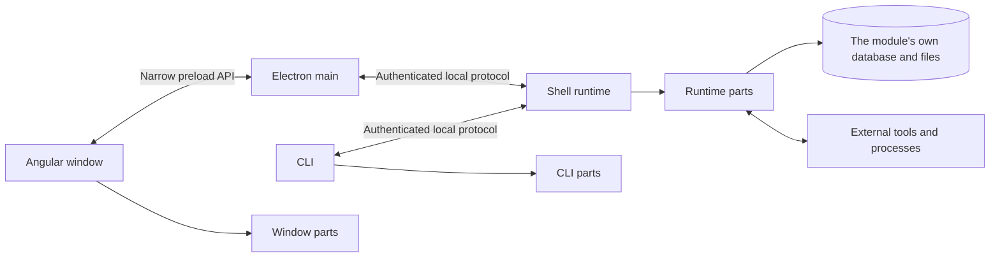

# TeamRun architecture

**Scope:** The shell, modules, runtime, protocol, storage and delivery. Each module arrives with its document, `src/modules/<id>/README.md`, owning its behavior, data and interface. [AGENTS.md](../AGENTS.md#documents) maps the other rule owners and defines documentation practice.

## 1. Product boundary

TeamRun's shell owns the window, layout, local runtime, storage and module mechanisms. Features—conversations, providers, terminals, editors and diffs—belong to modules.

Noldova writes every module and builds, delivers and updates it with the application. The shell remains usable with any set, including none, showing an empty workspace. Conversations is included in every release.

The desktop and CLI share the same local runtime and data directory. Local work requires no TeamRun cloud account or synchronization service.

Section 11 defines the deferred capabilities.

## 2. Components and dependency direction

The package layout has the following owners and dependency boundaries.

| Component | Responsibility | Dependency boundary |
|---|---|---|
| `src/foundation` | General-purpose primitives, JSON, services, data access and testing | Self-contained packages; no shell, module, Electron or Angular dependency |
| `src/shell/protocol` | The local protocol's envelope: handshake, requests, responses, events and failures | Browser-safe foundation packages; no database, process or UI-framework implementation |
| `src/shell/runtime` | Own a data directory, authenticate local clients, host the runtime parts of modules, route their requests and events, provide storage and run migrations | Shell protocol and foundation; also supplies client connection/launch facilities |
| `src/shell/cli` | Command-line client; hosts the CLI parts of modules | Shell protocol and the runtime's client facilities; no direct database writes |
| `src/shell/desktop` | Electron main process, preload, OS integration, the macOS menu bar, notifications and update coordination | Shell protocol and the runtime's client facilities; Electron remains confined to this boundary |
| `src/shell/ui` | The shared kit: tokens, styles, controls, the default theme and the Gallery, which shows each control in every theme and mode | Angular and browser-safe foundation; no shell mechanism and no module |
| `src/shell/window` | The Angular window: docking, tabs, the top bar, the status bar, Settings and the mechanisms of section 5; shows the kit's Gallery as a Settings page in development builds only; hosts the window parts of modules | Shell protocol, the kit and browser-safe foundation; privileged operations go through the preload bridge |
| `src/modules/<id>` | One module, in a package for each part it has: `protocol`, `runtime`, `window` and `cli` | Foundation, the shell's published APIs and the published APIs of the modules it declares |

Runtime calls and data flow are shown below; these arrows are not package-import permissions.

```mermaid
flowchart LR
  Window[Angular window] <-->|Narrow preload API| Desktop[Electron main]
  Desktop <-->|Authenticated local protocol| Runtime[Shell runtime]
  CLI[CLI] <-->|Authenticated local protocol| Runtime
  Window --> WindowParts[Window parts]
  CLI --> CliParts[CLI parts]
  Runtime --> RuntimeParts[Runtime parts]
  RuntimeParts --> Store[(The module's own database and files)]
  RuntimeParts <--> Tools[External tools and processes]
```

Four rules keep the shell empty:

- **The shell names no module.** No production source under `src/shell` or `src/foundation` imports a module or contains an identifier, text or special case that belongs to one. Tests and their fixtures are not production source.
- **A module uses only published APIs.** It imports its own packages, foundation, the shell's published APIs and the published APIs of the modules it declares as dependencies.
- **The build's module list names the modules an application build includes.** It lives in the root `package.json`, outside `src/shell`. Adding a module changes that list and no shell source. The build generates the file that brings the listed modules' window parts into the window, and a test build adds the fixture modules.
- **Automated checks enforce the first two rules and the unique names of section 3 on every change.**

Everything that belongs to a module lives in its folder, `src/modules/<id>`: its parts and their tests, end-to-end tests, styles, assets, migrations and its document. Adding a module adds its folder and a line in the build's module list; removing it removes both. Its data has its own folder in the data directory (section 3).

The Angular parts, `src/shell/ui`, `src/shell/window` and modules' window parts, are not packages. The Angular project in `src/`, with its own manifest and lockfile, compiles them from source into one application. The kit's published API is its `src/api/index.ts`, which other Angular parts import as `@noldova/teamrun-shell-ui`.

Fixture modules exist only for tests. They live with the tests that use them, in the `fixtures` beside those workflows under the [coding standards](CODING-STANDARDS.md#13-tests), and enter only a test build's module list.

The window and its parts never import runtime code. Clients share connection facilities without embedding another runtime. Sections 6 and 8 define their access to privileged operations.

## 3. Vocabulary and identity

| Concept | Meaning |
|---|---|
| Shell | The part of TeamRun that knows no feature: foundation and the packages under `src/shell` |
| Module | A unit of TeamRun's functionality, with its own identity and declared dependencies, built and delivered with the application |
| Host | A process that runs parts: the runtime, the window or the CLI |
| Part | The code of a module that runs in one host: a runtime part, a window part or a CLI part |
| Contribution | An entry a module adds to a shell mechanism, such as a view, a command or a protocol method |
| View | Contributed content for a panel, in a dock or in the middle |
| Document | Contributed content for a tab in the middle of the window |
| Setting scope | A level at which a setting can have its own value, such as the application or one object a module owns |
| Theme | An appearance the person chooses: colors for the light and dark modes and a look, defined by the [UI standards](UI-STANDARDS.md#2-themes-and-color) |
| Published API | What a module offers to the modules that depend on it |
| External tool | A program or service outside TeamRun that a module drives, such as a provider's tooling or a command-line shell |

A module's id is its stable identity: lowercase kebab-case, unique, and never reused for another module. `shell` is reserved for the shell and is no module's id. Display names are not identity.

Everything a module adds carries its id:

- Names the shell registers have the form `<id>.<name>`: protocol methods and events, commands, menus, settings, setting scopes, views, documents, status bar items, notifications and themes. An id contains no dot, so two owners cannot form the same name.
- Selectors and style tokens contain no dot and use the id as a prefix under the [coding](CODING-STANDARDS.md#package-organization) and [UI](UI-STANDARDS.md#9-the-shared-kit-and-modules) rules. Prefixes alone do not ensure uniqueness: an automated check rejects duplicate complete names across the shell and all modules.
- A module's folder in the data directory is `modules/<id>` and holds its database and files, so no id collides with the shell's own folders, such as `work` and `logs`.

## 4. Modules

### Parts

A module has only the parts it needs, in any combination: runtime for data, processes and privileged work; window for views, documents and settings pages; CLI for commands. Parts exchanging messages keep their models in the module's `protocol` package.

### Declaration

Each module declares its id, display name, parts, the modules it depends on and the themes it provides. Dependencies form no cycle. A host reads the declarations before it runs any module code, so it applies a theme without activating the module's parts.

### Lifecycle

The runtime decides which modules are active, and the window and the CLI follow it.

1. The runtime reads the build's declarations and orders modules after their dependencies.
2. Each runtime part activates once, registering contributions and published services. It receives only shell services and its declared dependencies' published services.
3. A module is active when its runtime part, if any, and all dependencies have activated. Otherwise the runtime records its failure; the shell and unaffected modules continue.
4. After handshake and reconnection, window/CLI hosts receive active modules and failures before sending module requests. They activate only active modules' parts, in dependency order.
5. Window/CLI activation failure affects that host alone: withdraw the failed part's contributions and do not activate dependent parts there. Runtime parts continue serving other clients.
6. The window displays each failure and cause; the CLI reports failures needed by the requested command.
7. Hosts deactivate parts in reverse order, releasing contributions, subscriptions, timers, files and child processes.

Activation stays light. A part loads heavy code when its first view opens or its first request arrives.

### Cooperation

Modules cooperate through published APIs, including contracts others implement and register. They never access another's database, files, settings or internals, directly or through shell internals. Section 2 governs dependencies.

### Trust

Built-in modules share the shell's privileges; declarations provide no sandbox. Every part follows the [secure-coding rules](CODING-STANDARDS.md#8-secure-coding), including request data/authority validation, and sections 6 and 8's authenticated runtime and window boundaries.

A module starts an external tool with only the environment that tool requires. A tool's output cannot grant permissions.

### Documentation

Each module's document, `src/modules/<id>/README.md`, has these sections, leaving out those that do not apply: purpose; parts and dependencies; published API; contributions; data (its database, files and what it keeps per device); behavior; and missing decisions.

## 5. Contributions

The shell owns registration, collisions, user overrides, persistence and removal at deactivation; modules own their entries. The shell has no feature-specific entry lists and registers its own entries, including the default theme and appearance/shortcut settings, through the same mechanisms.

| Mechanism | A module contributes | The shell |
|---|---|---|
| Views | Content for a panel, in a dock or in the middle, with its title and icon | Docks, splits, hides and restores it |
| Documents | Content for a tab in the middle, with its title and the breadcrumb the top bar shows for it | Opens, arranges, previews and restores tabs |
| Commands | Named actions | Runs them from menus, shortcuts, the top bar, the status bar and search |
| Shortcuts | A default key for a command | Reports collisions and applies the person's bindings |
| Top bar | Actions for the window's top row | Shows them in declared order beside the window controls and the active document's breadcrumb |
| Status bar | Items for its left or right side: text and icon, a tooltip and a command | Shows them along the bottom of the window, by side and declared order |
| Main menu | Items for the application menus (File, Edit, View, Help) or a menu of its own | Builds the menus and shows them in the macOS menu bar; their items are also reachable through command search. Without contributed menus, macOS shows a standard application, Edit and Window menu, so Quit, Copy and Paste work |
| Context menus | Items for the shell's context and panel menus and for its own | Shows them in declared order |
| Notifications | Operating-system notifications: a title, text and the command that opening one runs | Shows them through the operating system's notification service when the person's settings allow it |
| Settings | Settings with defaults and the scopes that may override them, their pages, and setting scopes for the objects it owns | Stores the values per scope, resolves the effective value, shows the pages and reports changes |
| Themes | Themes in its declaration: for each, colors for the light and dark modes and a look, as data | Offers them in Settings and applies the person's theme and mode before the window paints; uses the default theme when the chosen one is absent |
| Protocol | Methods and events | Authenticates, routes and delivers them |
| Storage | Its database's tables and migrations, and its files | Creates, migrates, backs up and closes its database |
| CLI | Commands | Reads the command line and runs the command |

When two default shortcuts collide, the one registered first keeps the key, Settings shows the collision, and the person's binding decides. A saved layout keeps the place of a view or document whose module is absent and shows it again when the module returns.

### Setting scopes

The application scope belongs to the shell. A module that owns a kind of object, such as a project or a conversation, contributes a scope for it and tells the shell which object encloses each one, such as a conversation's project; an object with none falls under the application scope. A setting declares which scopes may override it. Its effective value comes from the most specific scope that sets it, then each enclosing scope, then the application scope, then the default. When an object is deleted, the scope's owner asks the shell to remove the values stored for it.

### Notifications

A module decides when something deserves a notification; muting, for example for one conversation, is a setting at that object's scope, applied by the module. The shell shows a notification without taking focus. Opening it brings TeamRun's window forward and runs the notification's command. The person can turn notifications off entirely or for one module in Settings.

## 6. Runtime ownership and local protocol

### Ownership

- One runtime owns each canonical data directory. The default location is `~/.noldova/teamrun`; an explicit data directory allows an isolated workspace. Development and test runs never default to the person's data directory: each checkout uses its own unless one is given.
- The runtime acquires exclusive ownership before opening a database, activating a module, cleaning up owned processes or publishing an endpoint.
- Ownership uses a process-held exclusive transaction in a separate SQLite ownership database. Do not delete the ownership database to break a live lock.
- Discovery metadata is published atomically and identifies the endpoint, the owner process and the program it runs from, the product and protocol versions and the runtime's build.
- Process cleanup must establish recorded ownership, not rely on a reused process id alone.

### Endpoint and authentication

- Windows uses loopback TCP; macOS and Linux use a local Unix socket. The local endpoint is not exposed as a remote service.
- Local clients authenticate with a per-runtime capability token held in protected discovery metadata, with appropriate filesystem permissions on each OS. Loopback binding alone is not authentication.
- The window receives neither the token nor the socket.
- The local capability protects the endpoint from unauthorized clients; it is not an OS sandbox against another program running with the same user's privileges. The desktop separately validates IPC senders and limits the operations its preload exposes.

### Messages

- Connections begin with an authenticated version handshake. Subsequent framed requests are correlated with responses; events notify connected clients.
- The runtime client/server boundary owns framing, request size limits, deadlines, cancellation and disconnect handling.
- The shell validates protocol envelopes without knowing module models. Methods and events follow section 3's naming rules, using `shell.<name>` for shell-owned entries.
- The runtime routes only methods registered by active parts; the owning part validates payloads and reports failures under the [wire contract](CODING-STANDARDS.md#the-wire-contract).

### Builds and lifetime

- The first client may start a runtime; later clients attach only to their own build, carrying the same modules without separate module-protocol negotiation.
- A newer build takes over a directory an older build's runtime owns by itself. It asks the older runtime to stop; if work is in progress, the person makes section 9's choice to wait for it or stop it; then the older runtime exits and the newer one starts. An older build that finds a newer runtime hands the person over to the newer build instead of starting. The person is never asked to find and quit another TeamRun.
- Work may outlive clients until the idle policy permits shutdown.
- Explicit shutdown cancels owned work, resolves waiters, flushes state and closes resources; acknowledgement does not prove process exit.
- Reconnect from durable records, allowing for missed events.

### Launch on Linux

Starting a detached runtime on Linux requires executable Bash at `/bin/bash` and a readable, searchable `/proc/self/fd` from a mounted `/proc`. The launcher checks these before spawning and reports a missing requirement immediately. In the child, before executing the runtime, it closes inherited descriptors above standard input, output and error, so the runtime and the processes it starts do not keep the desktop's files or sockets. Standard streams are disconnected, and Bash startup files and inherited shell options are disabled. Windows and macOS use the host's direct process launch.

## 7. State and persistence

SQLite is the authority for durable records. The shell and each module that keeps records have their own database file in the data directory: the shell's for its facilities, and each module's in its folder (section 3). The ownership database of section 6 is separate.

- Only a database's owner opens it, reads and writes its rows, and defines its schema, mapping and mutations. The shell's database serves its facilities, never feature data.
- Each owner provides ordered migrations for its database. The shell runs its own first, then each module's in dependency order.
- No transaction spans two databases. A module reaches another module's data only through that module's published API. It keeps references to another module's records as that module's stable identities and handles a record that no longer exists.
- Modules keep all durable data in the data directory: records in their database and referenced files in their own folder. They add no storage files or folders to projects.
- A working folder, where the person's and the agents' files live, is not module data. A project's folder is wherever the person keeps it. A folder TeamRun creates for work outside any project, such as a conversation without one, lives in the data directory's `work` folder beside the `modules` folder, under a name that carries its owner's id (section 3). The owner creates and removes it, and any module may work in it as in a project folder.
- Records reference filesystem locations by stable, owner-defined identities mapped to paths per device. Moving the data directory preserves records; owners report missing paths for reconnection, never treating them as empty.
- Removing a module from a build preserves its database and files; deleting them requires a separate user request.

| State | Owner and lifetime |
|---|---|
| Migration history and change records | Each database's owner, in that database |
| Shortcuts, settings and their values per scope | The shell, in its database |
| Layout, window bounds and a window part's view state | The shell keeps layout and window bounds in its database, written through the runtime; the owning module keeps a part's view state in the data directory. State tied to a display or a window is kept for the device and window that recorded it; transient state stays in memory |
| Drafts and other content the person wrote but did not send | The owning module's database, saved through its runtime part |
| Credentials an external tool manages | That tool, accessed only through its supported interfaces |
| Caches | Bounded and transient; never the durable source of truth |
| Logs | The shell writes bounded, rotated logs for each process to the data directory's `logs` folder; modules log through the shell under their id, without secrets or unnecessary personal or project data |

Related writes and their durable change records commit atomically within one database. A change feed is not a guarantee of complete event delivery or a finished synchronization protocol.

Migrations are ordered, explicit and transactional:

- Validate that a database's existing migration history is a recognized prefix before modifying it.
- Back up a database before upgrading its schema, using a SQLite-aware operation that includes committed WAL data, and verify the completed backup before publishing it as a recovery point.
- Refuse unknown or newer schemas rather than resetting them.
- Destructive rollback, backup retention and cleanup of owned files require explicit policies; no automatic deletion is assumed.

TeamRun does not open data written by a release that predates the shell. The runtime refuses such a data directory, as it refuses an unknown schema, and neither migrates nor resets it. The window explains the refusal and offers to move that data aside: at the person's request, the runtime moves every entry except its ownership database into a new sibling folder named for the move and its date, deletes and overwrites nothing, and starts with an empty data directory. It moves entries rather than renaming the directory, because Windows cannot rename a folder while the ownership database inside it is open.

## 8. Window

The window presents confirmed state and keeps only transient state locally. Durable state goes to its section 7 owner after a pause in changes and at close. All privileged requests cross the shell's preload bridge and desktop's authenticated connection; window parts receive no token, socket, process or file handle.

Snapshot loading and event delivery can overlap: a window part replays or reconciles relevant events against a loaded snapshot and uses selection generations so an old response cannot replace a newer selection. Reconnect reloads potentially missed state.

Render external content under the [secure-coding rules](CODING-STANDARDS.md#8-secure-coding), never as markup able to reach the bridge. Open its links through the external-link path.

Persisted tabs and layout restore the person's saved workspace without opening unrelated content as a side effect of initialization.

## 9. Active work, closing and shutdown

A part reports the work it has in progress, such as a running reply or command, to its host. Before TeamRun quits, restarts for an update or stops for a newer build (section 6) while work is in progress, it asks the person whether to wait for the work or to stop it, and never interrupts it without that choice.

Closing TeamRun waits for each window to save its unsaved state. A window part that reports a failed save keeps TeamRun open with the error, while a window that is gone or does not answer before the timeout does not block closing.

## 10. Build, installation and updates

### Build inputs

- The repository is self-contained. Reviewed foundation source is built here; no sibling checkout, copied installation directory or private reference repository is a build dependency.
- Exact external dependency versions and lockfiles describe the install inputs.
- The root manifest declares the product version and, separately, the protocol version. The build stamps the product version into sibling packages consistently.
- The build also stamps the runtime with the fingerprint of the inputs it was compiled from. The fingerprint identifies the runtime's build: the same inputs give the same build, and any change gives another.
- Compile, package and install through one reproducible path. Tests and the window consume fresh installed artifacts, detecting stale inputs. The coding standards own public declarations and documentation.
- The Angular project in `src/` pins its own toolchain, including the TypeScript version Angular requires. The build installs it from its lockfile, separately from the packages, and the Angular CLI builds and tests the Angular parts. A package never imports from the Angular project's dependencies; it imports only what its own manifest declares.

### Modules and versions

Modules have no versions of their own. A release contains the shell and every module in its list at the release's version, and an update replaces them together. The runtime's fingerprint covers the modules it hosts.

### Targets and formats

- The target matrix is Windows, Linux and macOS, each on x64 and ARM64. Declare support for a target only after its build and native acceptance are verified.
- Formats: Windows NSIS, macOS DMG plus the ZIP its updater downloads, and Linux AppImage.
- Release downloads are named `TeamRun-<platform>-<arch>.<ext>` and each target's update information `latest-<platform>-<arch>.yml`. No file name contains the version, so an AppImage update replaces the installed file in place and keeps its location and launchers.
- Electron application resources use ASAR, with narrowly identified unpacked files where external execution or native loading requires them.

### Publication

- Publish an immutable reviewed revision and matching version, with platform- and CPU-specific installers, integrity data and update metadata.
- Build jobs do not receive publication authority. Only packaging jobs for a platform the release declares signed receive signing credentials, and publication rejects a package whose signing differs from that declaration.
- The publisher consumes the exact artifact identified by the successful build, including when only publication is retried; it must not guess the artifact from the retry's attempt number.
- Upload retries are bounded and verify any existing outcome. Incomplete uploads remain unpublished, and published tags and assets are not silently replaced.
- Releases use numbered versions such as `0.0.1` and `0.0.2`, without prerelease suffixes or build metadata, and matching `v`-prefixed tags. Each successful publication becomes the latest release.
- Published application updates must use a version newer than the installed version.
- Nightly builds, when introduced, remain downloadable pipeline artifacts; they do not create releases or enter the application update feed.

### Updates

- The installed updater checks an approved release feed for its platform and CPU. Every packaged target updates itself: Windows through its installer, macOS through Squirrel.Mac and a Linux AppImage by replacing the file.
- A macOS application must run from an Applications folder, because a copy macOS runs from a temporary read-only location cannot be replaced; an installation that cannot update itself explains why.
- The GitHub release route is anonymous HTTPS; a private repository is not made reachable by injecting repository or provider credentials.
- Validate metadata and downloaded bytes before offering installation. Production signing, notarization and trust requirements are distinct from an explicitly authorized unsigned test release. Source builds and incompatible targets do not accidentally use a production update feed.
- Download and restart/install are explicit user actions; ordinary application close does not install an update. Section 9 owns the choice the person makes while work is in progress.

Before replacing application files, coordinate every runtime and desktop using that installation, across data directories:

1. Confirm that no work is in progress, which the person's choice under section 9 ensures; then block new launches and requests, and freeze editing.
2. Acknowledge durable unsaved state and preferences.
3. Stop the processes modules own, flush and close databases, and verify process exit.
4. Create verified recovery backups.

Failure before installer handoff resumes surviving clients safely; uncertainty must not be treated as successful shutdown. After an AppImage update, the new version starts only once the old process has exited, from outside the old AppImage and without its open descriptors; a process holding the old version's files keeps the replaced AppImage mounted.

### Installation scope

Preserve application identity, the existing install location and scope, and data-directory compatibility unless an explicit migration changes them. A normal fresh Windows install defaults to the current user; an update uses the existing resolved scope and a quiet installer path. Existing all-users installations may require OS elevation. Ambiguous scope must not silently choose a different installation. An installer failure is not permission to downgrade a database or clear an uncertain launch barrier.

## 11. Deferred capability boundaries

TeamRun does not implement the following capabilities:

- **Installing, removing and disabling modules:** the person choosing which modules run requires rules for dependent modules, saved layouts and kept data. Until then the build's list decides.
- **Modules by other authors:** code that Noldova did not write requires a trust model, isolation and a compatibility promise for the shell's published APIs. Until then those APIs may change with any release, because every module is rebuilt with it.
- **A menu bar on Windows and Linux:** modules contribute to the main menu now, macOS shows it in its menu bar, and its items are reachable through command search; showing the menus inside the window needs a layout decision for the top row.
- **Remote runtimes and synchronization:** remote execution must identify where the work and the files live and define authenticated transport. Synchronization needs portable identity, account mapping and conflict rules. Credentials and an external tool's session files are not replicated; reconnecting remotely and replicating state are different operations.

These capabilities require reviewed contracts before implementation; cloud services, billing and schemas remain undecided.

## 12. Review and verification boundaries

[AGENTS.md](../AGENTS.md#work-and-review) owns import and review procedure; the [coding standards](CODING-STANDARDS.md) own authoring, API checks and license preservation. [TESTING.md](TESTING.md#6-verification-scope) owns verification and evidence across these architectural boundaries.
